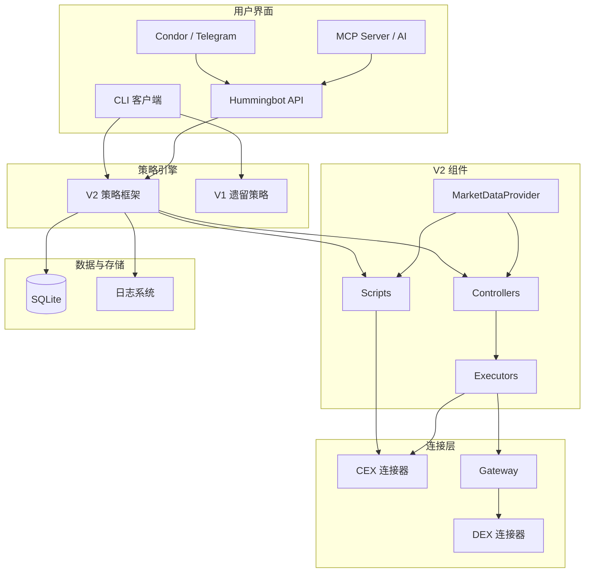

# Hummingbot 操作手册

> **版本**：基于 Hummingbot v2.14.0
> **文档抓取日期**：2026-04-27
> **内容来源**：官网文档 https://hummingbot.org/docs/ + 本地源码补充

---

## 目录

1. [概览](#1-概览)
2. [安装部署](#2-安装部署)
3. [客户端操作](#3-客户端操作)
4. [策略框架](#4-策略框架)
5. [连接器](#5-连接器)
6. [Gateway](#6-gateway)
7. [Hummingbot API](#7-hummingbot-api)
8. [MCP & Skills](#8-mcp--skills)
9. [Condor](#9-condor)
10. [Dashboard](#10-dashboard)
11. [Quants Lab](#11-quants-lab)
12. [高级配置](#12-高级配置)
13. [FAQ & 排障](#13-faq--排障)
14. [术语表](#14-术语表)

---

## 1. 概览

### 1.1 Hummingbot 是什么

Hummingbot 是一个开源的加密货币做市与交易机器人框架，支持在中心化交易所（CEX）和去中心化交易所（DEX）上运行自动化交易策略。项目使用 Python 3.10+ 开发，核心路径用 Cython 加速，基于 asyncio 异步架构。

### 1.2 生态组件

| 组件 | 说明 | 安装方式 |
|------|------|---------|
| **Hummingbot Client** | 核心交易客户端，CLI 界面，支持 CEX 交易 | Quickstart / 源码安装 |
| **Gateway** | DEX 中间件，支持 Uniswap、PancakeSwap、Raydium 等 30+ DEX | 源码安装 |
| **Hummingbot API** | REST API 后端，管理机器人、投资组合和交易 | Condor / 源码安装 |
| **Condor** | Telegram 机器人，监控和控制 Hummingbot 实例 | Quickstart |
| **MCP Server** | 连接 AI 助手（Claude、Gemini、ChatGPT）到 Hummingbot | 源码安装 |
| **Skills** | AI 助手的代理技能，管理策略、执行器和基础设施 | GitHub |
| **Dashboard** | Web 管理面板（已弃用） | GitHub |
| **Quants Lab** | 回测与策略分析研究环境 | GitHub |

### 1.3 组件关系图



### 1.4 数据流

```
用户配置 → 策略实例 → Controllers/Scripts → Executors → 连接器 → 交易所 API
                                        ↑
                               MarketDataProvider
```

- **数据层**：MarketDataProvider 统一提供市场数据（K 线、订单簿、交易记录）
- **决策层**：Scripts 或 Controllers 消费数据，制定策略决策
- **执行层**：Executors 执行具体的订单管理工作流
- **事件总线**：EventReporter 贯穿各层，实现松耦合通信

### 1.5 推荐使用路径

| 场景 | 推荐方案 |
|------|---------|
| 入门学习、本地使用、V1 策略 | Hummingbot Client（CLI） |
| 生产环境、多实例管理、云端部署 | Condor（Telegram 界面） |
| AI 助手集成 | MCP Server + Skills |
| DEX 交易 | Client + Gateway |
| 开发者 | 源码安装 + API |

---

## 2. 安装部署

### 核心概念

Hummingbot 安装部署涉及以下核心组件：

| 组件 | 说明 | 是否必需 |
|------|------|----------|
| **Hummingbot Client** | 核心客户端，包含策略引擎、连接器和 CLI 界面 | 必需 |
| **Gateway** | DEX 交易中间件，暴露标准化 REST 端点与区块链网络交互 | 可选（DEX 交易必需） |
| **Hummingbot API** | REST API 后端，用于程序化管理和多实例部署 | 可选 |
| **Condor** | 基于 Telegram 的管理界面，面向多实例和生产环境 | 可选 |

**安装方式选择指南**：

| 安装方式 | 适用场景 | 技术门槛 | 推荐程度 |
|----------|----------|----------|----------|
| **Docker** | 单实例运行、学习使用、快速上手 | 低 | 首选推荐 |
| **源码安装** | 开发者贡献代码、自定义修改 | 中 | 开发者推荐 |
| **Condor Quickstart** | 多实例管理、生产环境、Telegram 控制 | 中 | 生产环境推荐 |
| **Conda 手动安装** | 精细控制环境、研究用途 | 高 | 高级用户 |

### 配置参数（环境要求表）

#### 硬件要求

| 资源 | 最低要求 | 推荐配置 |
|------|----------|----------|
| CPU | 2 核 | 4 核+ |
| 内存 | 4 GB | 8 GB+ |
| 磁盘 | 10 GB 可用空间 | 20 GB+ SSD |
| 网络 | 稳定互联网连接 | 低延迟连接 |

#### 操作系统要求

| 平台 | 要求 | 备注 |
|------|------|------|
| **macOS** | macOS 12+ | 需安装 Docker Desktop 或 Conda |
| **Linux（桌面）** | Ubuntu 20.04+ | 需安装 Docker Desktop |
| **Linux（VPS/无头服务器）** | Ubuntu 20.04+ | 通过 Docker 安装脚本部署 |
| **Windows** | Windows 10+ WSL2 | 必须安装 Docker Desktop + WSL2 + Ubuntu 发行版，**所有命令须在 Ubuntu 终端中执行** |

#### 软件依赖

| 软件 | 版本要求 | 安装方式 | 用途 |
|------|----------|----------|------|
| **Docker** | 20.10+ | [官方安装](https://docs.docker.com/get-docker/) | Docker 安装方式必需 |
| **Docker Compose** | v2+ | 随 Docker Desktop 安装 | Docker 安装方式必需 |
| **Conda** | Miniconda/Anaconda | [Miniconda 安装](https://docs.conda.io/en/latest/miniconda.html) | 源码安装方式必需 |
| **Python** | 3.10+ | 由 Conda 环境管理 | 源码安装必需 |
| **Git** | 2.0+ | 系统包管理器 | 所有方式必需 |
| **Node.js** | 20.0+ | [nodesource](https://github.com/nodesource/distributions) | Gateway 源码安装必需 |
| **pnpm** | 最新版 | `npm install -g pnpm` | Gateway 源码安装必需 |

#### Conda 环境核心依赖（源码）

源码安装时，`make install` 基于 `setup/environment.yml` 自动创建名为 `hummingbot` 的 Conda 环境：

| 类别 | 包名 | 版本要求 |
|------|------|----------|
| **语言/构建** | Python | >=3.10.12 |
| | Cython | 最新 |
| | setuptools | ==80.8.0 |
| **异步/网络** | aiohttp | >=3.8.5 |
| | asyncssh | >=2.13.2 |
| **区块链** | web3 | 最新 |
| | eth-account | >=0.13.0 |
| | solders | >=0.19.0 (pip) |
| | xrpl-py | ==4.4.0 |
| | injective-py | ==1.13.* (pip) |
| **数据分析** | pandas | >=2.3.2 |
| | numpy | >=2.2.6 |
| | scipy | >=1.11.1 |
| | ta-lib | >=0.6.4 |
| | pandas-ta | >=0.4.71b |
| **CLI** | prompt_toolkit | >=3.0.39 |
| **配置/序列化** | ruamel.yaml | >=0.2.5 |
| | pydantic | >=2 |
| **数据库** | sqlalchemy | >=1.4.49 |
| **安全** | cryptography | >=41.0.2 |

> 当前源码版本：**v2.14.0**（build version: 20260421）

### 操作步骤

#### 2.1 Docker 安装（推荐）

**步骤 1：安装 Docker**

| 平台 | 操作 |
|------|------|
| macOS | 下载并安装 [Docker Desktop for Mac](https://www.docker.com/products/docker-desktop/) |
| Linux 桌面 | 下载并安装 [Docker Desktop for Linux](https://www.docker.com/products/docker-desktop/) |
| Linux VPS | `curl -fsSL https://get.docker.com -o get-docker.sh && sh get-docker.sh` |
| Windows | 安装 Docker Desktop + 启用 WSL2 + 安装 Ubuntu 发行版 |

**步骤 2：克隆仓库**

```bash
git clone https://github.com/hummingbot/hummingbot.git
cd hummingbot
```

**步骤 3：环境配置**

```bash
make setup
```

此命令会询问是否启用 Gateway：
- 输入 `y` — 启用 Gateway（DEX 交易需要），设置 `COMPOSE_PROFILES=gateway`
- 输入 `N` — 不启用 Gateway

如需后续启用/禁用 Gateway，编辑 `.compose.env` 文件：
```
COMPOSE_PROFILES=gateway    # 启用
COMPOSE_PROFILES=           # 禁用
```

**步骤 4：部署启动**

```bash
make deploy
```

**步骤 5：连接到 Hummingbot**

```bash
docker attach hummingbot
```

首次启动时设置密码，该密码用于加密交易所 API 密钥等敏感数据。

**步骤 6：连接交易所**

在 Hummingbot CLI 中执行：

```bash
connect binance
```

> **分离容器而不停止**：按 `Ctrl+P` 然后按 `Ctrl+Q`

#### 2.2 源码安装

**前置条件**：已安装 [Miniconda](https://docs.conda.io/en/latest/miniconda.html) 或 Anaconda。

**步骤 1：克隆仓库**

```bash
git clone https://github.com/hummingbot/hummingbot.git
cd hummingbot
```

**步骤 2：安装依赖**

```bash
make install
```

此命令执行：创建 Conda 环境 → 安装依赖 → 编译 Cython 扩展

> 如遇安装问题，可先执行 `make uninstall` 清除旧环境再重新安装。

**步骤 3：启动 Hummingbot**

```bash
make run
```

支持传入参数：

```bash
make run ARGS="-p -f conf_v2_with_controllers.yml"
```

**步骤 4：（可选）安装 Gateway**

若需 DEX 交易功能，参见 [2.5 Gateway 独立安装](#25-gateway-独立安装)。

#### 2.3 Condor Quickstart 安装

Condor 是面向生产环境的 Telegram 管理界面，部署时自动包含 Hummingbot API、PostgreSQL 和 EMQX 消息代理。

**部署架构**：

| 组件 | 说明 | 端口 |
|------|------|------|
| Condor | Telegram 机器人，监控与控制界面 | — |
| Hummingbot API | REST API 后端 | 8000 |
| PostgreSQL | 交易数据存储 | 5432 |
| EMQX | 消息代理（机器人通信） | 1883/8083 |

**步骤 1：获取 Telegram 凭证**

1. 在 Telegram 中搜索 `@BotFather`，创建新 Bot 并获取 **Bot Token**
2. 在 Telegram 中搜索 `@userinfobot`，获取你的 **User ID**

**步骤 2：克隆仓库并安装**

```bash
git clone https://github.com/hummingbot/condor.git
cd condor
make install
```

**步骤 3：启动运行**

```bash
make run
```

**步骤 4：验证安装**

- **Telegram**：向你的 Bot 发送消息测试交互
- **API 文档**：访问 `http://localhost:8000/docs` 查看 Swagger 文档
- **健康检查**：`curl http://localhost:8000/health`

#### 2.4 Conda 手动安装

适用于需要精细控制依赖版本或进行研究的用户。

```bash
git clone https://github.com/hummingbot/hummingbot.git
cd hummingbot

# 创建 Conda 环境
conda env create -n hummingbot -f setup/environment.yml

# 激活环境
conda activate hummingbot

# 配置开发路径
conda develop .

# 安装 pip 专有依赖
pip install --no-deps -r setup/pip_packages.txt

# 编译 Cython 扩展
python setup.py build_ext --inplace

# 启动
python bin/hummingbot_quickstart.py
```

#### 2.5 Gateway 独立安装

##### Docker 方式

编辑 `docker-compose.yml`，确保 Gateway 服务配置未被注释：

```yaml
gateway:
  profiles: ["gateway"]
  restart: always
  container_name: gateway
  image: hummingbot/gateway:latest
  ports:
    - "15888:15888"
  volumes:
    - "./gateway-files/conf:/home/gateway/conf"
    - "./gateway-files/logs:/home/gateway/logs"
    - "./certs:/home/gateway/certs"
  environment:
    - GATEWAY_PASSPHRASE=admin    # 修改为安全密码
    - DEV=true                     # 开发模式使用 HTTP；生产环境设为 false
```

启动：确保 `.compose.env` 中 `COMPOSE_PROFILES=gateway`，然后 `make deploy`

##### 源码方式

**前置条件**：Node.js >= 20.0.0、pnpm

```bash
git clone https://github.com/hummingbot/gateway.git
cd gateway

# 安装依赖并构建
pnpm install
pnpm build

# 运行配置脚本（首次安装选择全部选项）
pnpm run setup
```

`pnpm run setup` 会从 `/src/templates` 复制默认配置到 `/conf/`，可选择更新：
- `server.yml` — Gateway 服务器配置
- `chains/` — 链和网络配置
- `connectors/` — DEX 连接器配置
- `tokens/` — 每条链/网络的代币列表
- `pools/` — 每个 DEX 连接器的池列表

**运行 Gateway**：

```bash
# 开发模式（HTTP，默认）
pnpm start --passphrase=<你的密码>

# 生产模式（HTTPS，需 SSL 证书）
pnpm start --passphrase=<你的密码> --prod
```

**配置 SSL 证书（生产环境）**：

1. 启动 Hummingbot 客户端，执行 `gateway generate-certs`
2. 输入安全密码短语
3. 记录证书存储路径（`certs_path`）
4. 运行 `pnpm run setup`，选择关联证书并输入路径
5. 在 Hummingbot 的 `conf_client.yml` 中设置 `gateway_use_ssl: true`

**验证连接**：在 Hummingbot 界面右上角，`Gateway: ONLINE` 表示连接成功。若显示 `OFFLINE`，检查：
1. Gateway 是否在 15888 端口运行
2. `gateway_use_ssl` 是否与 Gateway 运行模式一致
3. 若使用 HTTPS，证书是否在两端正确配置

#### 2.6 Hummingbot API 安装

##### Docker 方式

参考 Condor Quickstart（2.3 节），API 作为组件自动部署。

##### 源码方式

```bash
git clone https://github.com/hummingbot/hummingbot-api
cd hummingbot-api

# 初始化配置
make setup

# 安装依赖
make install

# 启动依赖服务
docker compose up emqx postgres -d

# 启动 API（开发模式）
conda activate hummingbot-api
uvicorn main:app --reload
```

API 访问地址：`http://localhost:8000`

**安装 Python 客户端**：

```bash
pip install hummingbot-api-client
```

**环境变量配置**（`.env` 文件）：

| 变量 | 说明 | 默认值 |
|------|------|--------|
| `USERNAME` / `PASSWORD` | API 认证凭证 | 安装时设置 |
| `CONFIG_PASSWORD` | 加密机器人凭证的密码 | 安装时设置 |
| `DATABASE_URL` | PostgreSQL 连接串 | 源码: `localhost`; Docker: `hummingbot-postgres` |
| `BROKER_HOST` | EMQX 消息代理地址 | `localhost` |
| `GATEWAY_URL` | Gateway 地址 | `http://localhost:15888` |
| `DEBUG_MODE` | 调试模式（禁用 HTTP Basic Auth） | `false` |

### 命令参考

#### Docker 管理命令

| 命令 | 说明 |
|------|------|
| `make setup` | 配置环境，选择是否启用 Gateway |
| `make deploy` | 拉取镜像并启动容器（后台运行） |
| `make down` | 停止所有容器（包括 Gateway） |
| `docker attach hummingbot` | 连接到 Hummingbot 容器终端 |
| `docker compose logs -f hummingbot` | 查看 Hummingbot 实时日志 |

#### 源码管理命令

| 命令 | 说明 |
|------|------|
| `make install` | 创建/更新 Conda 环境并编译 |
| `make run` | 启动 Hummingbot 客户端 |
| `make run ARGS="-p -f strategy.yml"` | 指定参数启动 |
| `make uninstall` | 删除 Conda 环境 |
| `make test` | 运行测试 |

#### Gateway 命令

| 命令 | 说明 |
|------|------|
| `pnpm start --passphrase=<密码>` | 开发模式启动（HTTP） |
| `pnpm start --passphrase=<密码> --prod` | 生产模式启动（HTTPS） |
| `pnpm run setup` | 运行配置脚本 |
| `gateway generate-certs` | 在 Hummingbot CLI 中生成 SSL 证书 |

#### 更新升级

| 安装方式 | 更新步骤 |
|----------|----------|
| **Docker** | `docker compose down` → `docker pull hummingbot/hummingbot:latest` → `docker compose up -d` |
| **源码** | `git pull` → `make install` → `make run` |
| **Condor** | `cd condor` → `git pull` → `make install` → `make run` |

#### 常见故障排除

| 问题 | 解决方案 |
|------|----------|
| Conda 未找到 | 确保 Conda 已安装并加入 PATH：`conda --version` |
| Cython 编译失败 | Linux 确认 `build-essential` 已安装；macOS 确认 Xcode Command Line Tools 已安装 |
| Docker 端口冲突 | 修改 `docker-compose.yml` 中的端口映射 |
| Gateway 显示 OFFLINE | 确认 Gateway 在 15888 端口运行；检查 `gateway_use_ssl` 配置是否匹配 |
| API 数据库连接失败 | 运行 `./fix-database.sh`；确认使用 `hbot` 用户（非 `postgres`）连接 |

---

## 3. 客户端操作

### 核心概念

Hummingbot 客户端是一个基于命令行界面（CLI）的交易机器人框架，帮助用户无需编程技能即可构建和运行交易机器人。客户端采用事件驱动架构，核心数据流为：用户配置 → 策略实例 → 连接器 → 交易所 API → 订单管理 → 事件通知。

**界面布局**

CLI 界面分为五个面板：

| 面板 | 位置 | 功能 |
|------|------|------|
| 输入面板 | 左下 | 用户输入命令的区域 |
| 输出面板 | 左上 | 显示命令输出结果 |
| 日志面板 | 右侧 | 显示日志消息，可用 Ctrl+T 切换显示/隐藏 |
| 顶部导航栏 | 顶部 | 显示版本号、策略名称、配置文件名 |
| 底部导航栏 | 底部 | 显示交易数量/总P&L/回报率、CPU/内存使用率、运行时长 |

**键盘快捷键**

| 快捷键 | 功能 | 说明 |
|--------|------|------|
| 双击 Ctrl+C | 退出 | 退出 Hummingbot |
| Ctrl+S | 状态 | 显示机器人运行状态 |
| Ctrl+F | 搜索 | 在日志面板中切换搜索 |
| Ctrl+X | 退出配置 | 退出当前配置向导 |
| Ctrl+T | 切换日志 | 显示/隐藏日志面板 |
| Ctrl+A | 全选 | 输入面板中全选文本 |
| Ctrl+Z | 撤销 | 输入面板中撤销操作 |
| Ctrl+R | 重置样式 | 恢复默认颜色样式 |

> **平台差异**：macOS 使用 ⌘+C/⌘+V 复制粘贴，需先启用"Allow Mouse Reporting"（⌘+R）；Linux 粘贴用 Shift+右键；Windows 使用 Ctrl+Shift+C/V。

**运行模式**

- **交互模式**：启动后进入 CLI 界面，手动输入命令操作
- **无头模式（Headless）**：通过 `--headless` 参数或 `HEADLESS_MODE=true` 环境变量启用，配合 MQTT 远程监控和控制，适用于无人值守部署
- **自动启动（Autostart）**：在 Docker 或源码启动时指定配置文件和密码，自动运行策略

### 配置参数

Hummingbot 的配置通过 YAML 文件管理，所有配置文件位于 `conf/` 目录下。

**配置文件结构**

| 文件/目录 | 用途 |
|-----------|------|
| `conf/conf_client.yml` | 全局客户端配置（日志、Kill Switch、MQTT、余额限制等） |
| `conf/hummingbot_logs.yml` | 日志格式与轮转配置 |
| `conf/conf_fee_overrides.yml` | 手续费覆盖配置 |
| `conf/scripts/` | V2 脚本策略配置文件 |
| `conf/controllers/` | V2 控制器配置文件 |
| `conf/strategies/` | V1 策略配置文件 |
| `conf/connectors/` | 交易所连接器配置（API 密钥等，加密存储） |

**全局配置参数（conf_client.yml）**

| 参数 | 说明 | 默认值 |
|------|------|--------|
| `log_level` | 日志级别 | `INFO` |
| `kill_switch_mode` | Kill Switch 配置，含 `kill_switch_rate` | `{}`（禁用） |
| `autofill_import` | import 命令后自动填充提示 | `disabled` |
| `paper_trade` | 模拟交易配置，含交易所列表和默认余额 | 见下方 |
| `balance_asset_limit` | 各交易所资产使用限额 | 各交易所空对象 |
| `gateway` | Gateway 网关连接配置（host/port/ssl） | `localhost:15888` |
| `rate_oracle_source` | 汇率预言机数据源 | `binance` |
| `global_token` | 通用计价代币（如 USDT） | `USDT` |
| `rate_limits_share_pct` | API 速率限制分配百分比 | `100.0` |
| `send_error_logs` | 是否分享错误日志 | `true` |
| `db_mode` | 数据库配置（支持 SQLite/外部 DB） | `sqlite` |
| `mqtt_bridge` | MQTT 桥接配置 | 各项默认值 |

**模拟交易默认余额**

| 资产 | 余额 |
|------|------|
| BTC | 1.0 |
| ETH | 20.0 |
| SOL | 100.0 |
| USDT | 100,000.0 |
| USDC | 100,000.0 |
| WETH | 20.0 |
| DOGE | 1,000,000.0 |
| HBOT | 10,000,000.0 |

### 操作步骤

#### 启动与退出

**Docker 安装启动**

```bash
git clone https://github.com/hummingbot/hummingbot.git
cd hummingbot
make setup        # 配置环境
make deploy       # 后台启动
docker attach hummingbot
```

> **分离容器而不停止**：按 `Ctrl+P` 然后按 `Ctrl+Q`

**源码安装启动**

```bash
cd hummingbot
conda activate hummingbot
./start           # 1.19.0+ 版本使用 ./start 启动
```

**退出方式**

| 方式 | 命令/操作 | 行为 |
|------|-----------|------|
| 正常退出 | `exit` | 取消所有未完成订单后退出 |
| 强制退出 | `exit -f` | 跳过撤单直接退出 |
| 快捷退出 | 双击 Ctrl+C | 退出 Hummingbot |

> **注意**：二进制安装版直接关闭窗口不会自动撤单，活跃订单将保留在交易所。

#### 密码管理

**创建密码**：首次启动时系统提示创建密码，用于加密敏感数据（API 密钥、钱包私钥等）。

**重置密码**

```bash
# 1. 删除密码验证文件
sudo rm -rf conf/.password_verification

# 2. 必须同时删除连接器配置文件，否则会报错
rm conf/connectors/*.yml
```

> **重要**：重置密码后，旧连接器文件无法解密，必须重新连接所有交易所 API 密钥。

#### 连接交易所

```bash
>>> connect binance
```

系统会提示输入 API Key 和 API Secret。部分交易所可能需要额外信息（如 Kraken 需设置 Nonce Window ≥ 10）。

**安全建议**：仅开启 **读取 + 交易** 权限，无需开启提现/转账功能。

**检查连接状态**

```bash
>>> connect          # 不带参数，查看所有连接器状态
```

输出包含 **Keys Added**（API 密钥是否已添加）和 **Keys Confirmed**（是否成功连接）。

#### 配置策略

**V2 策略（推荐）**

```bash
>>> create --v2-config pmm_simple    # 创建脚本配置
>>> start --v2 conf_simple_pmm_1.yml  # 启动 V2 策略
```

**控制器配置**

```bash
>>> create --controller-config pmm_simple    # 创建控制器配置
```

配置保存在 `conf/controllers/`，通过 `v2_with_controllers` 加载器使用。

**V1 策略（旧版）**

```bash
>>> create              # 创建策略配置
>>> import              # 交互式选择导入已有配置
>>> start               # 启动
```

**修改配置**

```bash
>>> config              # 显示所有全局和策略配置
>>> config kill_switch_mode.kill_switch_rate -5   # 修改单个配置项
```

部分配置修改后需要执行 `stop` + `start` 重启策略才生效。

#### 余额查询

```bash
>>> balance                    # 查看所有已连接交易所余额
>>> balance paper              # 查看模拟交易余额
>>> balance paper BTC 0.5      # 设置模拟余额
>>> balance limit binance USDT 100   # 设置资产使用限额
```

**余额限制特殊值**

| 设置值 | 行为 |
|--------|------|
| `-1` | 禁用限额（不限制使用量） |
| `0` | 初始不会为该资产下任何订单，直到通过交易获得该资产 |

#### 查看运行状态

```bash
>>> status          # 查看当前状态
>>> status --live   # 实时监控状态
```

状态输出包含：Markets（交易所/交易对/价格）、Assets（资产余额/价值/占比）、Orders（订单详情）。

#### 查看交易历史

```bash
>>> history                  # 查看历史表现
>>> history --verbose        # 含交易明细
>>> history --days 7 --precision 4   # 指定天数和精度
```

**绩效计算公式**

| 指标 | 公式 |
|------|------|
| 平均价格 | 总报价交易量 / 总基础资产交易量 |
| 持有组合价值 | (基础起始资产 × 当前市价) + 报价起始资产 |
| 当前组合价值 | (基础当前资产 × 当前市价) + 报价当前资产 |
| 交易损益 | 当前组合价值 - 持有组合价值 |
| 总损益 | 交易损益 + 已付手续费 |
| 回报率 | 总损益 / 持有组合价值 |

#### 日志查看

**日志文件位置**

| 安装方式 | 日志路径 |
|---------|---------|
| 源码安装 | `hummingbot/logs/` |
| Docker 安装 | `hummingbot_files/hummingbot_logs/` |
| Windows 二进制 | `%localappdata%\hummingbot.io\Hummingbot\logs` |
| macOS 二进制 | `~/Library/Application Support/Hummingbot/Logs` |

日志文件名格式：`logs_$STRATEGY_FILE_PATH.log`，每日轮转，超过 7 个自动删除最旧文件。

#### 模拟交易（Paper Trading）

**启用方式**：创建策略时选择带 `_paper_trade` 后缀的交易所（如 `binance_paper_trade`）。

**添加交易所**：编辑 `conf/conf_client.yml`，在 `paper_trade_exchanges` 列表中添加交易所名称。

**切换到真实交易**：选择不带 `_paper_trade` 后缀的交易所，然后 `stop` + `start` 重启。

#### 风控功能

**Kill Switch（紧急停止开关）**

```yaml
# conf_client.yml 中配置
kill_switch_mode:
  kill_switch_rate: -5.0    # 亏损达 5% 时自动停止
```

> **注意**：即使未执行新交易，市场价格变动也会改变绩效表现，可能触发 Kill Switch。

**Balance Limit（余额限制）**

限定机器人在交易所中可使用的资产数量上限，适用于多机器人共用同一账户的场景。

#### 自动启动（Autostart）

**Docker Autostart**：编辑 `docker-compose.yml`，在 `environment` 中添加：

```yaml
environment:
  - CONFIG_PASSWORD=your_password
  - SCRIPT_CONFIG=conf_simple_pmm_1.yml     # V2 策略
```

**源码 Autostart**

```bash
# V2 策略
bin/hummingbot_quickstart.py -p PASSWORD --v2 conf_simple_pmm_1.yml

# V1 策略
bin/hummingbot_quickstart.py -p PASSWORD -f conf_pure_mm_1.yml

# 无头模式
bin/hummingbot_quickstart.py -p PASSWORD --v2 conf.yml --headless
```

#### 导出数据

```bash
>>> export keys     # 导出 API 密钥（需密码验证）
>>> export trades   # 导出交易记录为 CSV 文件
```

### 命令参考

#### 基础命令

| 命令 | 语法 | 功能 |
|------|------|------|
| `connect` | `connect [exchange]` | 列出可用交易所并添加 API 密钥；不带参数显示连接状态 |
| `create` | `create [--v2-config script_name] [--controller-config name]` | 创建策略配置文件 |
| `import` | `import [file_name]` | 导入已有策略配置文件 |
| `start` | `start [--v2 config_file]` | 启动当前策略 |
| `stop` | `stop` | 停止当前运行的策略并取消所有活跃订单 |
| `exit` | `exit [-f]` | 退出 Hummingbot；`-f` 强制退出 |
| `help` | `help [command]` | 显示帮助信息 |
| `config` | `config [key] [value]` | 显示或修改配置 |

#### 余额与状态命令

| 命令 | 语法 | 功能 |
|------|------|------|
| `balance` | `balance` | 显示所有已连接交易所和钱包的资产余额 |
| `balance paper` | `balance paper [asset] [amount]` | 查看/设置模拟交易余额 |
| `balance limit` | `balance limit [exchange] [asset] [amount]` | 查看/设置资产使用限额 |
| `status` | `status [--live]` | 显示当前策略运行状态 |
| `history` | `history [--days N] [--verbose] [--precision N]` | 查看交易历史表现 |
| `lphistory` | `lphistory [--days N] [--verbose]` | 查看 LP 流动性仓位历史和绩效 |

#### 市场数据命令

| 命令 | 语法 | 功能 |
|------|------|------|
| `ticker` | `ticker [--live] [--exchange name] [--market pair]` | 显示当前订单簿的市场行情 |
| `order_book` | `order_book [--lines N] [--exchange name] [--market pair] [--live]` | 显示订单簿深度 |
| `rate` | `rate [pair]` | 显示指定交易对的汇率 |

#### 导出命令

| 命令 | 语法 | 功能 |
|------|------|------|
| `export keys` | `export keys` | 导出 API 密钥和钱包私钥 |
| `export trades` | `export trades` | 导出交易记录为 CSV 文件 |

#### Gateway 命令

| 命令 | 语法 | 功能 |
|------|------|------|
| `gateway connect` | `gateway connect <chain>` | 为指定链添加钱包 |
| `gateway balance` | `gateway balance [chain] [tokens]` | 查看链上代币余额 |
| `gateway approve` | `gateway approve <connector> <tokens>` | 授权代币使用 |
| `gateway config` | `gateway config [namespace] [update] [path] [value]` | 查看/更新 Gateway 配置 |
| `gateway generate-certs` | `gateway generate-certs` | 生成 Gateway SSL 证书 |
| `gateway list` | `gateway list` | 列出可用链、网络和连接器 |
| `gateway lp` | `gateway lp <dex_type> <action> [pair]` | 管理 AMM/CLMM 流动性仓位 |
| `gateway ping` | `gateway ping [chain]` | 测试 Gateway 连接和节点状态 |
| `gateway pool` | `gateway pool <connector> <pair> [update]` | 查看/更新流动性池信息 |
| `gateway swap` | `gateway swap <connector> [pair] [side] [amount]` | 通过 DEX 执行代币兑换 |
| `gateway token` | `gateway token <symbol_or_address> [update]` | 查看/更新代币信息 |

#### MQTT 命令

| 命令 | 语法 | 功能 |
|------|------|------|
| `mqtt start` | `mqtt start [timeout]` | 启动 MQTT 桥接连接 |
| `mqtt stop` | `mqtt stop` | 停止 MQTT 桥接 |
| `mqtt restart` | `mqtt restart [timeout]` | 重启 MQTT 桥接 |

---

## 4. 策略框架

### 4.1 核心概念

Hummingbot 提供两代策略框架：**V1（遗留模板式）** 和 **V2（组件式）**。V2 框架自 2023 年引入，采用"乐高式"组件组合设计，官方强烈推荐所有新策略使用 V2 框架。

#### V1 vs V2 对比

| 维度 | V1 框架 | V2 框架 |
|------|---------|---------|
| **架构** | 单体策略模板，逻辑与参数紧耦合 | 模块化组件（Executor + Controller + Script），松耦合 |
| **继承基类** | `StrategyBase` → `StrategyPyBase` | `StrategyV2Base`（Script）/ `ControllerBase`（Controller） |
| **订单管理** | 直接调用 `buy()` / `sell()` | 通过 Executor 自动管理订单生命周期 |
| **多策略并行** | 不支持，一个实例只能运行一个策略 | 支持，单实例可同时运行多个 Controller |
| **配置方式** | YAML 配置文件，参数固定 | Pydantic Config 类，支持运行时热更新 |
| **市场数据** | 内置 Candles/OrderBook 访问 | `MarketDataProvider` 统一数据访问接口 |
| **API 可访问** | 否 | 是，Executor 可通过 API 直接创建 |
| **维护状态** | 社区维护，不再积极开发 | 官方积极开发和维护 |

#### V2 架构总览

```
MarketDataProvider ──→ 提供数据 ──→ Controllers/Scripts ──→ 编排 ──→ Executors ──→ 执行交易
```

**策略运行周期**（每个时钟 tick，通常 1 秒）：
1. **数据采集** — 从交易所获取实时 OrderBook、余额、订单状态
2. **数据处理** — `MarketDataProvider` 提供 Candles/OrderBook/Trades 数据
3. **决策** — Controller 基于市场数据和执行器状态生成 `ExecutorAction`
4. **执行** — `ExecutorOrchestrator` 处理 Create/Stop/Store 动作

### 4.2 V2 策略架构

#### 4.2.1 Executors（执行器）

Executor 是 V2 框架的原子执行单元，负责自动化地放置、管理和关闭订单。每个 Executor 封装一个离散的交易工作流，具有有限生命周期（active → closed/failed）。

**共有特性**：自包含（自主管理订单）、有限生命周期、API 可访问、可组合

**ExecutorOrchestrator** 管理类，处理三类动作：
- `CreateExecutorAction` — 实例化执行器
- `StopExecutorAction` — 优雅停止执行器
- `StoreExecutorAction` — 存储执行器数据用于性能分析

**执行器关闭原因（CloseType）**：

| CloseType | 说明 |
|-----------|------|
| `TIME_LIMIT` | 超时 |
| `STOP_LOSS` | 止损触发 |
| `TAKE_PROFIT` | 止盈触发 |
| `EXPIRED` | 过期 |
| `EARLY_STOP` | 提前停止 |
| `TRAILING_STOP` | 追踪止损触发 |
| `INSUFFICIENT_BALANCE` | 余额不足 |
| `FAILED` | 执行失败 |
| `COMPLETED` | 正常完成 |
| `POSITION_HOLD` | 仓位持有 |

##### PositionExecutor（仓位执行器）

管理单笔仓位的开仓和平仓，通过 **TripleBarrierConfig（三重屏障）** 进行风险控制。

**配置参数**（`PositionExecutorConfig`）：

| 参数 | 类型 | 默认值 | 说明 |
|------|------|--------|------|
| `connector_name` | str | — | 交易所连接器名称 |
| `trading_pair` | str | — | 交易对（如 `BTC-USDT`） |
| `side` | TradeType | — | 交易方向（BUY/SELL） |
| `amount` | Decimal | — | 交易数量（基础资产） |
| `entry_price` | Optional[Decimal] | None | 入场价格，None 表示市价入场 |
| `leverage` | int | 1 | 杠杆倍数 |
| `triple_barrier_config` | TripleBarrierConfig | 默认 | 三重屏障风险控制配置 |

**TripleBarrierConfig（三重屏障配置）**：

| 参数 | 类型 | 默认值 | 说明 |
|------|------|--------|------|
| `stop_loss` | Optional[Decimal] | None | 止损比例（如 0.03 = 3%） |
| `take_profit` | Optional[Decimal] | None | 止盈比例（如 0.02 = 2%） |
| `time_limit` | Optional[int] | None | 时间限制（秒） |
| `trailing_stop` | Optional[TrailingStop] | None | 追踪止损配置 |
| `open_order_type` | OrderType | LIMIT | 开仓订单类型 |
| `take_profit_order_type` | OrderType | MARKET | 止盈平仓订单类型 |
| `stop_loss_order_type` | OrderType | MARKET | 止损平仓订单类型 |

**TrailingStop（追踪止损）**：

| 参数 | 类型 | 说明 |
|------|------|------|
| `activation_price` | Decimal | 激活价格（偏离入场价的百分比） |
| `trailing_delta` | Decimal | 追踪距离（偏离最高/最低价的百分比） |

##### DCAExecutor（定投执行器）

按预设价格梯度分批建仓，实现美元成本平均法。

**配置参数**（`DCAExecutorConfig`）：

| 参数 | 类型 | 默认值 | 说明 |
|------|------|--------|------|
| `connector_name` | str | — | 交易所连接器名称 |
| `trading_pair` | str | — | 交易对 |
| `side` | TradeType | — | 交易方向 |
| `leverage` | int | 1 | 杠杆倍数 |
| `amounts_quote` | List[Decimal] | — | 每层的报价资产金额列表 |
| `prices` | List[Decimal] | — | 每层的目标价格列表 |
| `take_profit` | Optional[Decimal] | None | 止盈比例 |
| `stop_loss` | Optional[Decimal] | None | 止损比例 |
| `trailing_stop` | Optional[TrailingStop] | None | 追踪止损 |
| `time_limit` | Optional[int] | None | 时间限制（秒） |
| `mode` | DCAMode | MAKER | 执行模式：MAKER / TAKER |

##### GridExecutor（网格执行器）

在价格区间内按网格模式自动放置买卖订单。

**配置参数**（`GridExecutorConfig`）：

| 参数 | 类型 | 默认值 | 说明 |
|------|------|--------|------|
| `connector_name` | str | — | 交易所连接器名称 |
| `trading_pair` | str | — | 交易对 |
| `start_price` | Decimal | — | 网格起始价格 |
| `end_price` | Decimal | — | 网格结束价格 |
| `limit_price` | Decimal | — | 网格限制价格（触发整体平仓） |
| `side` | TradeType | BUY | 网格方向 |
| `total_amount_quote` | Decimal | — | 总投入金额（报价资产） |
| `min_spread_between_orders` | Decimal | 0.0005 | 网格订单间最小价差 |
| `max_open_orders` | int | 5 | 最大同时挂单数 |
| `triple_barrier_config` | TripleBarrierConfig | — | 三重屏障配置 |
| `leverage` | int | 20 | 杠杆倍数 |
| `keep_position` | bool | False | 关闭后是否保留仓位 |

##### TWAPExecutor（时间加权执行器）

将大额订单拆分为多个小额订单，在指定时间段内均匀执行。

**配置参数**（`TWAPExecutorConfig`）：

| 参数 | 类型 | 默认值 | 说明 |
|------|------|--------|------|
| `connector_name` | str | — | 交易所连接器名称 |
| `trading_pair` | str | — | 交易对 |
| `side` | TradeType | — | 交易方向 |
| `total_amount_quote` | Decimal | — | 总金额（报价资产） |
| `total_duration` | int | — | 总执行时长（秒） |
| `order_interval` | int | — | 下单间隔（秒） |
| `mode` | TWAPMode | TAKER | 执行模式 |

##### XEMMExecutor（跨所做市执行器）

在两个交易所间进行跨交易所做市。

**配置参数**（`XEMMExecutorConfig`）：

| 参数 | 类型 | 默认值 | 说明 |
|------|------|--------|------|
| `buying_market` | ConnectorPair | — | 买入市场 |
| `selling_market` | ConnectorPair | — | 卖出市场 |
| `maker_side` | TradeType | — | 做市方向 |
| `order_amount` | Decimal | — | 单笔订单数量 |
| `min_profitability` | Decimal | — | 最小盈利阈值 |
| `target_profitability` | Decimal | — | 目标盈利 |

##### ArbitrageExecutor（套利执行器）

在不同市场间捕捉价格差异进行套利。

**配置参数**（`ArbitrageExecutorConfig`）：

| 参数 | 类型 | 默认值 | 说明 |
|------|------|--------|------|
| `buying_market` | ConnectorPair | — | 买入市场 |
| `selling_market` | ConnectorPair | — | 卖出市场 |
| `order_amount` | Decimal | — | 订单数量 |
| `min_profitability` | Decimal | — | 最小盈利阈值 |

##### LPExecutor（流动性提供执行器）

在 CLMM DEX 上自动化提供流动性（v2.13.0 新增）。

**生命周期**：Open → Monitor → Rebalance → Close

**配置参数**（`LPExecutorConfig`）：

| 参数 | 类型 | 默认值 | 说明 |
|------|------|--------|------|
| `connector_name` | str | — | 网络连接器（如 `solana-mainnet-beta`） |
| `lp_provider` | str | — | LP 提供者，格式 `dex/trading_type` |
| `swap_provider` | Optional[str] | None | Swap 提供者（用于平仓后换回原始代币） |
| `pool_address` | str | — | 链上池地址 |
| `trading_pair` | str | — | 交易对 |
| `lower_price` | Decimal | — | 价格下界 |
| `upper_price` | Decimal | — | 价格上界 |
| `base_amount` | Decimal | 0 | 基础代币数量 |
| `quote_amount` | Decimal | 0 | 报价代币数量 |
| `side` | TradeType | — | 方向：BUY/SELL/RANGE |
| `keep_position` | bool | True | 关闭后是否保留净代币变化为现货仓位 |

#### 4.2.2 Scripts（脚本）

Script 是 V2 策略的入口点，继承自 `StrategyV2Base`，可直接访问 Executor、`MarketDataProvider` 和 Candles 数据。适用于学习、测试、简单单品种策略的原型开发。

```bash
create --v2-config [SCRIPT_NAME]    # 创建配置
start --v2 [SCRIPT_CONFIG_FILE]     # 运行脚本
```

**关键方法**：`on_tick`（策略心跳，每 tick 调用）、`format_status`（自定义状态显示）

> **注意**：如果脚本遇到错误，必须完全退出 Hummingbot 并重启，`stop` 命令无法修复错误。

#### 4.2.3 Controllers（控制器）

Controller 是 V2 框架的生产级构建块，定义可复用、模块化的子策略。由 `v2_with_controllers.py` 加载，单实例可同时运行多个 Controller。

##### Controller 基类配置

**`ControllerConfigBase`（所有 Controller 配置基类）**：

| 参数 | 类型 | 默认值 | 说明 |
|------|------|--------|------|
| `id` | str | — | 唯一标识符 |
| `controller_name` | str | — | Controller 名称 |
| `controller_type` | str | "generic" | Controller 类型 |
| `total_amount_quote` | Decimal | 100 | 交易总金额（报价资产） |
| `manual_kill_switch` | bool | False | 手动停止开关 |

**`DirectionalTradingControllerConfigBase`（方向性交易基类配置）**：

| 参数 | 类型 | 默认值 | 说明 |
|------|------|--------|------|
| `connector_name` | str | "binance_perpetual" | 交易所连接器 |
| `trading_pair` | str | "WLD-USDT" | 交易对 |
| `max_executors_per_side` | int | 2 | 每侧最大执行器数 |
| `cooldown_time` | int | 300 | 信号执行后冷却时间（秒） |
| `leverage` | int | 20 | 杠杆倍数 |
| `stop_loss` | Optional[Decimal] | 0.03 | 止损（如 0.03 = 3%） |
| `take_profit` | Optional[Decimal] | 0.02 | 止盈（如 0.02 = 2%） |
| `time_limit` | Optional[int] | 2700 | 时间限制（秒） |
| `trailing_stop` | Optional[TrailingStop] | None | 追踪止损 |

**`MarketMakingControllerConfigBase`（做市基类配置）**：

| 参数 | 类型 | 默认值 | 说明 |
|------|------|--------|------|
| `connector_name` | str | "binance_perpetual" | 交易所连接器 |
| `trading_pair` | str | "WLD-USDT" | 交易对 |
| `buy_spreads` | List[float] | [0.01, 0.02] | 买入价差列表 |
| `sell_spreads` | List[float] | [0.01, 0.02] | 卖出价差列表 |
| `executor_refresh_time` | int | 300 | 执行器刷新时间（秒） |
| `cooldown_time` | int | 15 | 成交后冷却时间（秒） |
| `leverage` | int | 20 | 杠杆倍数 |
| `stop_loss` | Optional[Decimal] | 0.03 | 止损 |
| `take_profit` | Optional[Decimal] | 0.02 | 止盈 |
| `time_limit` | Optional[int] | 2700 | 时间限制 |

##### 做市 Controller

| Controller | CLI 名称 | 说明 |
|-----------|---------|------|
| **pmm_simple** | `market_making.pmm_simple` | 简单纯做市，按配置价差在中间价两侧放置 PositionExecutor |
| **pmm_dynamic** | `market_making.pmm_dynamic` | 动态做市，使用 MACD 偏移中间价、NATR 动态调整价差 |
| **dman_maker_v2** | `market_making.dman_maker_v2` | D-Man Maker V2，使用 DCAExecutor 实现多层级做市 |

**pmm_dynamic 特有配置**：

| 参数 | 类型 | 默认值 | 说明 |
|------|------|--------|------|
| `candles_connector` | str | 同 connector_name | Candles 数据源连接器 |
| `interval` | str | "3m" | K 线周期 |
| `macd_fast` | int | 21 | MACD 快线周期 |
| `macd_slow` | int | 42 | MACD 慢线周期 |
| `macd_signal` | int | 9 | MACD 信号线周期 |
| `natr_length` | int | 14 | NATR 长度 |

**dman_maker_v2 特有配置**：

| 参数 | 类型 | 默认值 | 说明 |
|------|------|--------|------|
| `dca_spreads` | List[Decimal] | [0.01, 0.02, 0.04, 0.08] | 每层 DCA 价差 |
| `dca_amounts` | List[Decimal] | [0.1, 0.2, 0.4, 0.8] | 每层 DCA 金额比例 |

##### 方向性交易 Controller

| Controller | CLI 名称 | 说明 |
|-----------|---------|------|
| **bollinger_v1/v2** | `directional_trading.bollinger_v1/v2` | 布林带策略，BBP 低于阈值做多、高于阈值做空 |
| **bollingrid** | `directional_trading.bollingrid` | 布林带+网格组合策略 |
| **macd_bb_v1** | `directional_trading.macd_bb_v1` | MACD+布林带双重确认信号 |
| **supertrend_v1** | `directional_trading.supertrend_v1` | 超级趋势指标策略 |
| **dman_v3** | `directional_trading.dman_v3` | D-Man V3 方向性策略，结合布林带+DCA |
| **ai_livestream** | `directional_trading.ai_livestream` | AI 实时流策略，通过 MQTT 接收 ML 模型信号 |

**bollinger_v1/v2 特有配置**：

| 参数 | 类型 | 默认值 | 说明 |
|------|------|--------|------|
| `candles_connector` | str | 同 connector_name | Candles 数据源 |
| `interval` | str | "3m" | K 线周期 |
| `bb_length` | int | 100 | 布林带长度 |
| `bb_std` | float | 2.0 | 布林带标准差 |
| `bb_long_threshold` | float | 0.0 | 做多信号阈值 |
| `bb_short_threshold` | float | 1.0 | 做空信号阈值 |

**supertrend_v1 特有配置**：

| 参数 | 类型 | 默认值 | 说明 |
|------|------|--------|------|
| `length` | int | 20 | 超级趋势长度 |
| `multiplier` | float | 4.0 | 超级趋势乘数 |
| `percentage_threshold` | float | 0.01 | 百分比阈值 |

##### 通用 Controller

| Controller | CLI 名称 | 说明 |
|-----------|---------|------|
| **pmm_v1** | `generic.pmm_v1` | 复制遗留纯做市策略功能 |
| **pmm_mister** | `generic.pmm_mister` | 高级做市，具有悬挂执行器、价格距离保护 |
| **grid_strike** | `generic.grid_strike` | 网格打击策略，在价格范围内创建 GridExecutor |
| **multi_grid_strike** | `generic.multi_grid_strike` | 多网格打击策略 |
| **xemm_multiple_levels** | `generic.xemm_multiple_levels` | 多层级跨所做市 |
| **arbitrage_controller** | `generic.arbitrage_controller` | 套利控制器 |
| **stat_arb** | `generic.stat_arb` | 统计套利，基于价差 Z-Score |
| **hedge_asset** | `generic.hedge_asset` | 资产对冲，现货持仓+永续合约对冲 |
| **quantum_grid_allocator** | `generic.quantum_grid_allocator` | 量子网格分配器 |
| **lp_rebalancer** | `generic.lp_rebalancer.lp_rebalancer` | LP 再平衡控制器（v2.13.0 新增） |

**stat_arb 特有配置**：

| 参数 | 类型 | 默认值 | 说明 |
|------|------|--------|------|
| `connector_pair_dominant` | ConnectorPair | — | 主导资产交易对 |
| `connector_pair_hedge` | ConnectorPair | — | 对冲资产交易对 |
| `lookback_period` | int | 300 | 回看周期 |
| `entry_threshold` | Decimal | 2.0 | 入场阈值（Z-Score） |
| `tp_global` | Decimal | 0.01 | 全局止盈 |
| `sl_global` | Decimal | 0.05 | 全局止损 |

**lp_rebalancer 特有配置**：

| 参数 | 类型 | 默认值 | 说明 |
|------|------|--------|------|
| `lp_provider` | str | "orca/clmm" | LP 提供者 |
| `pool_address` | str | — | 链上池地址 |
| `position_width_pct` | Decimal | 0.5 | 仓位宽度百分比 |
| `rebalance_threshold_pct` | Decimal | 1 | 再平衡阈值百分比 |
| `autoswap` | bool | False | 自动换币 |

#### 4.2.4 MarketDataProvider（市场数据提供者）

V2 框架中市场数据的统一访问接口。

**API 方法**：

| 方法 | 返回类型 | 说明 |
|------|----------|------|
| `get_price_by_type(connector, pair, price_type)` | `Price` | 获取指定类型的价格 |
| `get_price_for_volume(connector, pair, volume, is_buy)` | `OrderBookQueryResult` | 获取指定成交量可达价格 |
| `get_volume_for_price(connector, pair, price, is_buy)` | `OrderBookQueryResult` | 获取指定价格水平的可成交量 |
| `get_order_book_snapshot(connector, pair)` | `Tuple[DataFrame, DataFrame]` | 获取 OrderBook 快照 |
| `get_candles_df(connector, pair, interval, max_records)` | `DataFrame` | 获取 OHLCV K 线数据 |

### 4.3 V1 遗留策略

V1 策略是 Hummingbot 2019 年发布时的原始模板式策略，官方不再积极维护。

| 策略 | 说明 |
|------|------|
| **pure_market_making** | 单品种做市，在中间价两侧放置限价买卖订单 |
| **avellaneda_market_making** | 基于 Avellaneda-Stoikov 论文的做市策略，自动计算最优价差 |
| **cross_exchange_market_making** | 跨交易所做市，通过对冲降低库存风险 |
| **amm_arb** | AMM 套利，捕捉 AMM DEX 与其他交易所间的价差 |
| **cross_exchange_mining** | 跨交易所挖矿（社区维护版） |
| **hedge** | 使用永续合约对冲现货库存风险 |
| **liquidity_mining** | 流动性挖矿，跨多品种提供流动性 |
| **perpetual_market_making** | 永续合约做市（社区贡献） |
| **spot_perpetual_arbitrage** | 现货-永续套利 |

### 4.4 策略选择指南

#### 按交易目标选择

| 目标 | 推荐 Controller | 推荐执行器 |
|------|-----------------|-----------|
| 单品种做市 | `pmm_simple` / `pmm_dynamic` | PositionExecutor |
| 多品种做市 | 多个 `pmm_simple` 实例 | PositionExecutor |
| 高级做市+库存管理 | `pmm_mister` | PositionExecutor |
| 分批建仓 | `dman_maker_v2` / `dman_v3` | DCAExecutor |
| 网格交易 | `grid_strike` / `multi_grid_strike` | GridExecutor |
| 布林带方向性 | `bollinger_v1` / `bollinger_v2` | PositionExecutor |
| MACD+布林带确认 | `macd_bb_v1` | PositionExecutor |
| 超级趋势跟踪 | `supertrend_v1` | PositionExecutor |
| 跨所做市 | `xemm_multiple_levels` | XEMMExecutor |
| 价差套利 | `arbitrage_controller` | ArbitrageExecutor |
| 统计套利 | `stat_arb` | PositionExecutor |
| 现货对冲 | `hedge_asset` | OrderExecutor |
| LP 流动性 | `lp_rebalancer` | LPExecutor |
| AI 信号交易 | `ai_livestream` | PositionExecutor |

#### 按经验水平选择

| 经验水平 | 推荐 |
|----------|------|
| **初学者** | Script + `pmm_simple` |
| **中级用户** | Controller + `pmm_dynamic` / `bollinger_v1` |
| **高级用户** | 多 Controller + 自定义 Controller |
| **机构级** | `v2_with_controllers` + API + MQTT 监控 |

---

## 5. 连接器

连接器是 Hummingbot 与交易所和区块链网络之间的桥梁，负责处理订单提交与取消、余额查询、订单簿数据同步及交易事件监听。

### 核心概念

#### CEX 与 DEX 连接器的区别

| 特性 | CEX 连接器 | CLOB DEX 连接器 | Gateway AMM 连接器 |
|------|-----------|----------------|-------------------|
| 交易模式 | 中心化撮合 | 链上订单簿 | 自动做市商（AMM） |
| 认证方式 | API Key + Secret | 钱包私钥 | 钱包私钥（Gateway 管理） |
| 订单类型 | 限价单/市价单 | 限价单/市价单 | 互换（Swap） |
| 资金托管 | 交易所托管 | 链上自托管 | 链上自托管 |
| 配置方式 | `connect` 命令 | `connect` 命令 | `gateway connect` 命令 |

#### 连接器架构

```
ConnectorBase（基类）
├── ExchangePyBase（现货交易基类）
│   ├── CEX 现货连接器（Binance、OKX 等）
│   └── CLOB 现货连接器（Hyperliquid、Injective 等）
├── PerpetualDerivativePyBase（永续衍生品基类）
│   └── CEX/CLOB 永续合约连接器
└── GatewayBase（Gateway 连接器基类）
    └── AMM DEX 连接器（通过 Gateway 中间件）
```

### 配置参数

#### CEX 连接器通用配置

| 参数 | 说明 |
|------|------|
| `connector` | 连接器名称 |
| `<connector>_api_key` | 交易所 API Key |
| `<connector>_api_secret` | 交易所 API Secret |

部分连接器额外参数：

| 连接器 | 额外参数 |
|--------|---------|
| OKX / OKX Perpetual | `passphrase`、`registration_sub_domain` |
| KuCoin / KuCoin Perpetual | `passphrase` |
| Bitget / Bitget Perpetual | `passphrase` |
| Kraken | `api_tier`（Starter/Intermediate/Pro） |
| Gate.io Perpetual | `user_id` |

#### CLOB DEX 连接器配置

| 连接器 | 配置参数 |
|--------|---------|
| Hyperliquid | `hyperliquid_mode`、`use_vault`、地址、私钥 |
| Injective | `network`、`account_type`、`fee_calculator` |
| XRPL | `xrpl_secret_key`、`wss_node_urls` |
| Derive | 钱包地址、私钥、`sub_id`、`account_type` |
| Vertex | Arbitrum 私钥、钱包地址 |

#### 测试网连接器

| 主连接器 | 测试网连接器 |
|---------|-----------|
| `binance_perpetual` | `binance_perpetual_testnet` |
| `bybit` / `bybit_perpetual` | `bybit_testnet` / `bybit_perpetual_testnet` |
| `hyperliquid` | `hyperliquid_testnet` |

### 操作步骤

#### 连接 CEX / CLOB 连接器

```bash
>>> connect binance    # 输入 API Key 和 Secret
>>> connect            # 查看所有连接器状态
```

#### 连接 Gateway DEX 连接器

```bash
>>> gateway connect ethereum    # 连接链上钱包
>>> gateway list                # 查看可用连接器
>>> gateway balance             # 查看链上余额
```

### 命令参考

| 命令 | 说明 |
|------|------|
| `connect` | 显示所有已配置连接器的连接状态 |
| `connect <name>` | 连接指定交易所 |
| `gateway connect <chain>` | 连接链上钱包 |
| `gateway list` | 列出可用 Gateway 连接器 |
| `gateway balance [chain]` | 查看链上余额 |
| `gateway approve <connector> <tokens>` | 批准代币使用 |

### 现货交易所连接器列表

#### 中心化交易所（CEX）

| 连接器名称 | 交易所 | Maker/Taker 费率 | 凭据 |
|-----------|--------|-----------------|------|
| `binance` | Binance | 0.10% / 0.10% | API Key + Secret |
| `bybit` | Bybit | 0.10% / 0.10% | API Key + Secret |
| `okx` | OKX | 0.08% / 0.10% | API Key + Secret + Passphrase |
| `gate_io` | Gate.io | 0.20% / 0.20% | API Key + Secret |
| `kucoin` | KuCoin | 0.10% / 0.10% | API Key + Secret + Passphrase |
| `kraken` | Kraken | 0.25% / 0.40% | API Key + Secret + API Tier |
| `bitget` | Bitget | 0.20% / 0.20% | API Key + Secret + Passphrase |
| `htx` | HTX（火币） | 0.20% / 0.20% | API Key + Secret |
| `coinbase_advanced_trade` | Coinbase Advanced | 0.40% / 0.60% | API Key + Secret |
| `mexc` | MEXC | — | API Key + Secret |
| `bitmart` | BitMart | — | API Key + Secret |
| `ascend_ex` | AscendEX | — | API Key + Secret |
| `backpack` | Backpack | — | API Key + Secret |
| `bing_x` | BingX | — | API Key + Secret |
| `bitrue` | Bitrue | — | API Key + Secret |
| `bitstamp` | Bitstamp | — | API Key + Secret |
| `btc_markets` | BTC Markets | — | API Key + Secret |
| `cube` | Cube | — | API Key + Secret |
| `dexalot` | Dexalot | — | 钱包地址 + 私钥 |
| `foxbit` | Foxbit | — | API Key + Secret |
| `ndax` | NDAX | — | API Key + Secret |

#### 去中心化交易所（CLOB DEX）

| 连接器名称 | 交易所 | 凭据 |
|-----------|--------|------|
| `hyperliquid` | Hyperliquid | 钱包地址 + 私钥 |
| `injective_v2` | Injective | 私钥/Seed Phrase |
| `derive` | Derive | 钱包地址 + 私钥 + 子账户 ID |
| `vertex` | Vertex | Arbitrum 私钥 |
| `xrpl` | XRP Ledger | XRPL Secret Key |

#### 特殊连接器

| 连接器名称 | 说明 |
|-----------|------|
| `paper_trade` | 模拟交易连接器，无需真实 API |

### 衍生品连接器列表

#### 中心化交易所永续合约

| 连接器名称 | 交易所 | Maker/Taker 费率 | 凭据 |
|-----------|--------|-----------------|------|
| `binance_perpetual` | Binance Futures | 0.02% / 0.04% | API Key + Secret |
| `bybit_perpetual` | Bybit Futures | 0.06% / 0.01% | API Key + Secret |
| `okx_perpetual` | OKX Futures | 0.02% / 0.05% | API Key + Secret + Passphrase |
| `gate_io_perpetual` | Gate.io Futures | 0.015% / 0.05% | API Key + Secret + User ID |
| `bitget_perpetual` | Bitget Futures | — | API Key + Secret + Passphrase |
| `kucoin_perpetual` | KuCoin Futures | — | API Key + Secret + Passphrase |
| `bitmart_perpetual` | BitMart Futures | — | API Key + Secret |
| `backpack_perpetual` | Backpack | — | 钱包凭据 |

#### 去中心化交易所永续合约

| 连接器名称 | 交易所 |
|-----------|--------|
| `hyperliquid_perpetual` | Hyperliquid |
| `dydx_v4_perpetual` | dYdX v4 |
| `injective_v2_perpetual` | Injective |
| `derive_perpetual` | Derive |
| `aevo_perpetual` | Aevo |
| `architect_perpetual` | Architect |
| `decibel_perpetual` | Decibel |
| `grvt_perpetual` | GRVT |

### Gateway DEX 连接器列表

Gateway 连接器通过 Gateway 中间件访问 AMM 型去中心化交易所。运行 `gateway list` 查看当前可用连接器。

| 协议 | 类型 | 支持链 |
|------|------|--------|
| Uniswap | AMM/CLMM | Ethereum, Polygon, Avalanche, BSC, Arbitrum, Optimism, Base |
| SushiSwap | AMM | Ethereum, Polygon, Avalanche, BSC, Arbitrum |
| PancakeSwap | AMM | BSC, Solana |
| Jupiter | Router | Solana |
| Raydium | AMM/CLMM | Solana |
| Orca | CLMM | Solana |
| Meteora | CLMM | Solana |
| 0x | Router | Ethereum, Polygon, BSC, Avalanche |
| Trader Joe | AMM | Avalanche |
| QuickSwap | AMM | Polygon |
| Curve | StableSwap | Ethereum, Polygon |
| Balancer | AMM | Ethereum |

---

## 6. Gateway

Gateway 是基于 TypeScript 的 API 服务器，作为 Hummingbot 客户端与去中心化交易所之间的中间件层，通过标准化 REST API 端点为不同区块链网络和 DEX 协议提供统一接口。

### 核心概念

#### 三种连接器类型

| 特性 | Router | AMM | CLMM |
|------|--------|-----|------|
| **全称** | DEX 聚合器 | 恒定乘积做市商 | 集中流动性做市商 |
| **核心公式** | 跨协议寻路 | x * y = k | 集中流动性在自定义价格区间 |
| **资金效率** | 高（最优路径拆单） | 低 | 高 |
| **适用场景** | Swap 交易 | Swap + LP | Swap + 高级 LP |
| **LP 操作** | 不支持 | 添加/移除流动性 | 开仓/平仓/收取手续费 |
| **典型代表** | Jupiter、0x | Uniswap V2、Raydium AMM | Uniswap V3、Orca、Meteora |

> 同一个 DEX 可能同时支持多种类型，使用 `dex_name/trading_type` 格式指定，如 `uniswap/router`、`orca/clmm`。

### 配置参数

Gateway 配置采用 YAML 文件层级结构，位于 `gateway-files/conf/` 目录下：

```
gateway-files/conf/
├── server.yml              # 服务器全局配置
├── apiKeys.yml             # API 密钥集中管理
├── chains/                 # 链级配置
│   ├── ethereum.yml        # 以太坊链全局配置
│   ├── solana.yml          # Solana 链全局配置
│   ├── ethereum/           # 以太坊网络配置
│   │   ├── mainnet.yml
│   │   ├── arbitrum.yml
│   │   └── ...
│   └── solana/             # Solana 网络配置
├── connectors/             # 连接器配置
├── tokens/                 # 代币列表
└── pools/                  # 流动性池配置
```

#### server.yml 关键参数

| 参数 | 默认值 | 说明 |
|------|--------|------|
| `port` | 15888 | Gateway API 服务器端口 |
| `certificatePath` | `./certs/` | SSL 证书目录路径 |
| `ipWhitelist` | `[]` | 允许访问的 IP 白名单 |

#### 链级配置关键参数

| 参数 | 说明 |
|------|------|
| `nodeURL` | RPC 节点 URL |
| `chainID` | 链 ID |
| `swapProvider` | 默认 Swap 提供商 |
| `baseFee` / `priorityFee` | EIP-1559 Gas 费用（EVM） |
| `priorityFeeLevel` | 优先费级别（Solana） |

### 操作步骤

#### 配置 RPC 节点

```bash
# 配置 Infura（EVM）
gateway config infura update apiKey <your-key>
gateway config ethereum update rpcProvider infura

# 配置 Helius（Solana）
gateway config helius update apiKey <your-key>
gateway config solana update rpcProvider helius
```

#### 连接钱包

```bash
gateway connect ethereum    # 添加以太坊钱包
gateway connect solana      # 添加 Solana 钱包
```

#### 执行 Swap

```bash
gateway swap solana-mainnet-beta SOL-USDC BUY 1
```

#### 提供流动性

```bash
# AMM 流动性
gateway lp raydium/amm add-liquidity SOL-USDC

# CLMM 集中流动性
gateway lp orca/clmm add-liquidity SOL-USDC
gateway lp orca/clmm collect-fees SOL-USDC    # 收取手续费（仅 CLMM）
```

### 命令参考

| 命令 | 说明 |
|------|------|
| `gateway connect <chain>` | 查看和添加链钱包 |
| `gateway balance [chain] [tokens]` | 查询钱包余额 |
| `gateway approve <connector> <tokens>` | 批准代币支出授权 |
| `gateway config [namespace]` | 查看/更新 Gateway 配置 |
| `gateway generate-certs` | 生成 SSL 自签名证书 |
| `gateway list` | 列出所有可用连接器 |
| `gateway lp <dex_type> <action> [pair]` | 管理流动性仓位 |
| `gateway ping [chain]` | 测试 Gateway 连通性 |
| `gateway pool <connector> <pair>` | 查看/更新池子信息 |
| `gateway swap <connector> [pair] [side] [amount]` | 执行代币交换 |
| `gateway token <symbol_or_address>` | 查看/更新代币信息 |

### 支持的链和连接器

#### 支持的区块链网络

**EVM 兼容链**：Ethereum Mainnet、Arbitrum、Optimism、Base、Polygon、BNB Chain、Avalanche、Celo、Sepolia

**Solana 生态**：Mainnet Beta、Devnet

#### 活跃连接器

| 连接器 | 链 | Router | AMM | CLMM |
|--------|-----|--------|-----|------|
| Jupiter | Solana | ✅ | — | — |
| Raydium | Solana | — | ✅ | ✅ |
| Orca | Solana | — | — | ✅ |
| Meteora | Solana | — | — | ✅ |
| PancakeSwap (Solana) | Solana | — | — | ✅ |
| Uniswap | Ethereum/EVM | ✅ | ✅ | ✅ |
| PancakeSwap | Ethereum/EVM | ✅ | ✅ | ✅ |
| 0x | Ethereum/EVM | ✅ | — | — |

---

## 7. Hummingbot API

Hummingbot API 是运行 Hummingbot 交易机器人的中央管理枢纽，提供 RESTful API 框架用于跨多个交易所管理交易操作。

### 核心概念

#### 系统架构

```
客户端层（Condor / Swagger UI / MCP）
    ↓
Hummingbot API 层（FastAPI + PostgreSQL + EMQX）
    ↓
机器人层（独立的 Hummingbot 容器实例）
    ↓
交易所层（Binance / OKX / Hyperliquid / ...）
```

#### 三种交互方式

| 方式 | 适用场景 |
|------|---------|
| **Condor** | 通过 Telegram 控制，适合移动监控 |
| **Swagger UI** | 交互式 REST API 文档，适合开发者调试 |
| **MCP** | 通过 Claude/ChatGPT/Gemini 自然语言交易 |

### 配置参数

| 变量 | 说明 | 默认值 |
|------|------|--------|
| `USERNAME` / `PASSWORD` | API 认证凭证 | 安装时设置 |
| `CONFIG_PASSWORD` | 加密机器人凭证的密码 | 安装时设置 |
| `DATABASE_URL` | PostgreSQL 连接串 | `localhost` / `hummingbot-postgres` |
| `BROKER_HOST` | EMQX 消息代理地址 | `localhost` |
| `GATEWAY_URL` | Gateway 地址 | `http://localhost:15888` |
| `DEBUG_MODE` | 调试模式（禁用 HTTP Basic Auth） | `false` |

### 操作步骤

#### 源码安装

```bash
git clone https://github.com/hummingbot/hummingbot-api
cd hummingbot-api
make setup      # 初始化配置
make install    # 安装依赖
docker compose up emqx postgres -d    # 启动依赖服务
conda activate hummingbot-api
uvicorn main:app --reload              # 启动 API
```

#### Python 客户端

```bash
pip install hummingbot-api-client
```

```python
from hummingbot_api_client import HummingbotAPIClient
client = HummingbotAPIClient(base_url="http://localhost:8000", username="admin", password="admin")
```

#### 快速验证

```bash
curl http://localhost:8000/health           # 健康检查
# 浏览器访问 http://localhost:8000/docs     # Swagger 文档
```

### 命令参考（API 端点）

所有端点基于 `http://localhost:8000`，需 HTTP Basic Auth。

#### Docker 管理

| 方法 | 路径 | 说明 |
|------|------|------|
| GET | `/docker/active-containers` | 运行中的机器人容器 |
| POST | `/docker/stop-container/{name}` | 停止容器 |
| POST | `/docker/start-container/{name}` | 启动容器 |

#### 账户管理

| 方法 | 路径 | 说明 |
|------|------|------|
| GET | `/accounts/` | 列出已配置的 API 账户 |
| POST | `/accounts/add-credential/{account}/{connector}` | 添加连接器凭证 |

#### 投资组合

| 方法 | 路径 | 说明 |
|------|------|------|
| POST | `/portfolio/state` | 获取当前余额和估值 |
| POST | `/portfolio/history` | 获取历史投资组合快照 |

#### 交易操作

| 方法 | 路径 | 说明 |
|------|------|------|
| POST | `/trading/orders` | 下单 |
| POST | `/trading/{account}/{connector}/orders/{id}/cancel` | 取消订单 |
| POST | `/trading/positions` | 查询永续合约持仓 |

#### 市场数据

| 方法 | 路径 | 说明 |
|------|------|------|
| POST | `/market-data/candles` | 获取 K 线数据 |
| POST | `/market-data/order-book` | 获取订单簿快照 |
| POST | `/market-data/funding-info` | 获取资金费率 |

#### 执行器

| 方法 | 路径 | 说明 |
|------|------|------|
| POST | `/executors/` | 创建执行器 |
| POST | `/executors/{id}/stop` | 停止执行器 |
| GET | `/executors/{id}/performance` | 获取表现指标 |

#### 机器人编排

| 方法 | 路径 | 说明 |
|------|------|------|
| POST | `/bot-orchestration/start-bot` | 启动机器人实例 |
| POST | `/bot-orchestration/stop-bot` | 停止机器人实例 |
| GET | `/bot-orchestration/status` | 获取所有机器人状态 |

#### Gateway 管理

| 方法 | 路径 | 说明 |
|------|------|------|
| GET | `/gateway/status` | Gateway 服务状态 |
| POST | `/gateway/swap/execute` | 执行 DEX 交换 |
| POST | `/gateway/clmm/add-liquidity` | 添加 CLMM 流动性 |

---

## 8. MCP & Skills

MCP（Model Context Protocol）Server 将 AI 助手连接到 Hummingbot 交易基础设施，Skills 则为 AI 助手提供管理策略、执行器和基础设施的代理能力。

### 核心概念

- **MCP Server**：MCP 协议的服务端实现，充当 AI 助手（Claude Code、Gemini CLI、Codex CLI 等）与 Hummingbot API 之间的桥梁，让 AI 助手以自然语言控制交易基础设施
- **Skills**：面向 AI 代理的结构化能力包，每个 Skill 封装命令定义（`SKILL.md`）和可执行脚本（`scripts/`），**不需要运行服务器**，通过自包含脚本直接调用 Hummingbot API
- **与 Condor 的关系**：Condor 是面向终端用户的 Telegram 界面，MCP 是面向 AI 助手的程序化接口
- **组件关系**：

```
AI 助手（Claude Code / Gemini CLI / Codex CLI）
  ├─ MCP Server（实时交互）──→ Hummingbot API ──→ Hummingbot 核心 / Gateway / 交易所
  └─ Skills（脚本执行）──→ Hummingbot API ──→ 同上
```

MCP Server 依赖 Hummingbot API 运行；Skills 直接调用 Hummingbot API，无需 MCP Server；两者共享相同的 API 认证凭证。

### 配置参数

#### MCP Server 环境变量

| 参数名 | 类型 | 默认值 | 说明 |
|--------|------|--------|------|
| `HUMMINGBOT_API_URL` | string | `http://localhost:8000` | Hummingbot API 地址（首次运行生效，后续由 server.yml 管理） |
| `HUMMINGBOT_USERNAME` | string | `admin` | API 认证用户名 |
| `HUMMINGBOT_PASSWORD` | string | `admin` | API 认证密码 |
| `HUMMINGBOT_TIMEOUT` | float | `30.0` | 连接超时秒数 |
| `HUMMINGBOT_MAX_RETRIES` | int | `3` | 最大重试次数 |
| `HUMMINGBOT_RETRY_DELAY` | float | `2.0` | 重试间隔秒数 |
| `HUMMINGBOT_LOG_LEVEL` | string | `INFO` | 日志级别 |

首次运行后，配置持久化到 `~/.hummingbot_mcp/server.yml`，后续修改通过 `configure_server` 工具完成。

#### MCP Server Docker 配置

| 参数 | 值 | 说明 |
|------|------|------|
| 传输方式 | `stdio` | MCP 协议传输层 |
| Docker 镜像 | `hummingbot/hummingbot-mcp:latest` | 生产环境推荐 |
| 数据卷 | `hummingbot_mcp:/root/.hummingbot_mcp` | 持久化配置 |

#### Skills 环境变量

| 参数名 | 类型 | 默认值 | 说明 |
|--------|------|--------|------|
| `HUMMINGBOT_API_URL` | string | `http://localhost:8000` | API 基础 URL |
| `API_USER` | string | `admin` | API 用户名 |
| `API_PASS` | string | `admin` | API 密码 |

### 操作步骤

#### 部署 MCP Server

1. 确保 Hummingbot API 服务器运行（通过 `hummingbot-deploy` skill 或 Condor Quickstart 部署）
2. 安装 Docker 并确认其正在运行
3. 获取 API 凭证（部署时设置的用户名和密码）

#### 连接 MCP Server 到 AI 助手

**Claude Code（推荐，一条命令）：**

```bash
claude mcp add --transport stdio hummingbot -- docker run --rm -i \
  -e HUMMINGBOT_API_URL=http://host.docker.internal:8000 \
  -e HUMMINGBOT_USERNAME=admin \
  -e HUMMINGBOT_PASSWORD=admin \
  -v hummingbot_mcp:/root/.hummingbot_mcp \
  hummingbot/hummingbot-mcp:latest
```

**Gemini CLI**：编辑 `~/.gemini/settings.json`，在 `mcpServers` 下添加 `hummingbot` 配置项，然后 `gemini /mcp list` 验证。

**Codex CLI**：编辑 `~/.codex/config.toml`，添加 `[mcp_servers.hummingbot]` 配置段，然后 `codex /mcp` 验证。

**Docker MCP Catalog**：Docker Desktop → MCP Toolkit → Catalog → 搜索 "Hummingbot MCP Server" → 安装 → 配置环境变量 → 连接客户端。

#### 安装 Skills

```bash
npx skills add hummingbot/skills --yes    # 安装所有 skills
npx skills add hummingbot/skills/skills/lp-agent --yes  # 安装单个 skill
npx skills list  # 查看已安装 skills
```

### 命令参考

#### MCP 工具组

| 工具组 | 功能 |
|--------|------|
| `configure_server` | 查看/更新 API 连接配置 |
| Accounts | 账户管理、连接器凭证、Gateway 钱包 |
| Portfolio | 余额快照、历史记录、代币/账户分布 |
| Trading | 下单、撤单、查询活跃订单/订单历史/交易历史、持仓/杠杆/资金费率 |
| Market Data | 价格、K线、订单簿、资金费率 |
| Rate Oracle | 列出数据源、获取/更新预言机配置、批量查询费率 |
| Bot Orchestration | 启动/停止命名机器人、查询状态/历史、MQTT 健康检查 |
| Executors | 创建/搜索/停止执行器、查看摘要/性能/日志/持仓 |
| Scripts & Controllers | 增删改查脚本/控制器/YAML 配置、获取配置模板 |
| Gateway & DEX | 容器生命周期、配置/连接器/代币/池子管理、兑换报价/执行、CLMM 持仓/流动性 |

#### Skills 命令

| 命令 | 说明 |
|------|------|
| `npx skills add hummingbot/skills --yes` | 安装所有 skills |
| `npx skills add hummingbot/skills/skills/<名称> --yes` | 安装指定 skill |
| `npx skills list` | 列出已安装 skills |
| `npx skills remove <名称>` | 移除已安装 skill |

#### 核心 Skills

| Skill | 说明 |
|-------|------|
| **lp-agent** | CLMM DEX 流动性提供：启动 LP 策略、管理仓位、分析绩效、导出数据 |
| **hummingbot-developer** | 开发环境：安装仓库、验证构建、运行开发栈、冒烟测试 |
| **find-arbitrage-opps** | 套利扫描：扫描 CEX/DEX 套利机会 |
| **find-xemm-opps** | XEMM 扫描：扫描跨交易所做市机会，自动生成配置 |

---

## 9. Condor

Condor 是 Hummingbot 基金会推出的开源交易 Agent 框架，将 LLM 与 Hummingbot 交易基础设施连接，让用户通过自然语言管理 50+ 交易所和区块链上的自动化交易。

### 核心概念

#### 双层架构

Condor 采用严格的双层架构，将概率性推理与确定性执行分离：

| 层 | 职责 | 技术实现 |
|---|---|---|
| **Agent 层（概率性）** | 解读市场行情、推理策略、做出决策 | LLM（Claude / GPT / Gemini） |
| **执行层（确定性）** | 将决策转化为订单，可靠可审计地执行 | Hummingbot API |

#### OODA 循环

Trading Agent 遵循 OODA 循环（观察-判断-决策-行动）：

| 阶段 | 目的 | 示例 |
|---|---|---|
| **Observe（观察）** | 定义所需数据 | 订单簿、K 线、持仓、余额 |
| **Orient（判断）** | 构建数据处理例程 | 自定义指标、信号生成器 |
| **Decide（决策）** | 将决策逻辑交给 LLM | 策略规则、进出场条件 |
| **Act（行动）** | 通过 Hummingbot API 执行 | 下单、管理仓位、部署执行器 |

#### 核心功能模块

| 功能 | 说明 |
|---|---|
| **Trading Agents** | AI 驱动的 Agent，每个 tick 使用 LLM 做出决策 |
| **Executors** | 自包含的交易操作，带有标准化 PnL 追踪 |
| **Positions** | 虚拟投资组合追踪，支持现货、永续合约和 LP 仓位 |
| **Bots** | Docker 容器，用于持久运行的做市和网格交易策略 |
| **Routines** | 确定性工作流，用于指标、Webhook 和告警 |

### 配置参数

#### Trading Agent 配置

每个 Trading Agent 由 `agent.md` 文件定义，包含 YAML 前置元数据和 Markdown 正文：

```yaml
---
name: Grid Trader
tick_interval: 60
connectors:
  - binance_perpetual
configs:
  trading_pair: BTC-USDT
  grid_levels: 5
limits:
  max_position_size: 1000
  max_drawdown_percentage: 5
---
```

**configs 与 limits 的区别**：

| 类型 | 说明 | 修改权限 |
|---|---|---|
| **configs** | 控制 Agent 行为 | Agent 可建议修改，用户审批 |
| **limits** | 安全护栏 | 仅用户可修改，Agent 永远不能自行更改 |

#### 风险引擎参数

| 参数 | 默认值 | 说明 |
|---|---|---|
| `max_position_size_quote` | $500 | 单仓最大规模 |
| `max_daily_loss_quote` | $50 | 每日亏损限额 |
| `max_drawdown_pct` | 10% | 最大回撤 |
| `max_open_executors` | 5 | 最大并发持仓数 |
| `max_single_order_quote` | $100 | 单笔订单最大规模 |
| `max_cost_per_day_usd` | $5 | 每日 LLM 费用限额 |

### 操作步骤

#### 安装

```bash
curl -fsSL https://raw.githubusercontent.com/hummingbot/deploy/refs/heads/main/setup.sh | bash
```

脚本自动完成：克隆仓库 → 安装依赖 → 交互式提示输入 Telegram Bot Token 和用户 ID

#### 配置 Telegram Bot

1. 在 Telegram 中搜索 `@BotFather`，发送 `/newbot` 创建 Bot，获取 **Bot Token**
2. 在 Telegram 中搜索 `@userinfobot`，获取你的 **User ID**
3. 安装脚本运行时交互式提示输入上述信息
4. 启动 Condor，在 Telegram 中发送 `/start` 连接

#### 访问 Web 仪表盘

在 Telegram 中发送 `/web` 命令，生成 5 分钟有效的安全登录链接。

#### 创建 Trading Agent

1. 在 Telegram 中发送 `/agents`
2. 使用 `/agent` 命令进入 Agent Builder 模式
3. 用自然语言描述策略，Builder 引导完成 OODA 四阶段配置
4. Builder 自动生成 `agent.md` 文件
5. 确认后部署 Agent

### 命令参考

#### Telegram 命令

| 命令 | 功能 |
|---|---|
| `/start` | 显示主菜单，检查 API 服务器状态 |
| `/keys` | 安全管理交易所 API 凭证 |
| `/portfolio` | 查看所有连接交易所的余额 |
| `/bots` | 列出和管理运行中的 Bot 容器 |
| `/agents` | 列出、创建和部署 Trading Agent |
| `/agent` | 进入 Agent Builder 模式 |
| `/web` | 生成 Web 仪表盘安全登录链接 |

#### 支持的 LLM

| LLM | 说明 |
|---|---|
| Claude | Anthropic 出品 |
| GPT | OpenAI 出品 |
| Gemini | Google 出品 |

---

## 10. Dashboard

Hummingbot Dashboard 是一个开源图形界面，帮助用户跨多个交易所管理投资组合、配置和回测策略，以及部署和管理多个 Hummingbot 实例。**Dashboard 已被标记为弃用**，官方将推出基于 Condor 架构的新版浏览器 Dashboard。

### 核心概念

| 功能 | 说明 |
|------|------|
| 凭证管理（Credentials） | 管理交易所 API 密钥 |
| 投资组合（Portfolio） | 跨多个交易所查看资产组合 |
| 策略配置（Config） | 配置策略控制器参数 |
| 策略回测（Backtest） | 利用历史数据评估策略表现 |
| 实例部署（Deploy） | 部署多个机器人实例 |
| 实例管理（Instances） | 管理已部署实例并监控实时性能 |

Dashboard 基于 Streamlit 构建，从 v2.7.0 起由 Hummingbot API 驱动。源代码托管在 [GitHub](https://github.com/hummingbot/dashboard)。

### 配置参数

#### 策略控制器

Config Generator 提供七种策略控制器：PMM Simple、PMM Dynamic、D-Man Maker V2、Bollinger V1、MACD BB V1、SuperTrend V1、XEMM Controller

#### 实例监控指标

| 指标 | 说明 |
|------|------|
| Net PNL (Quote) | 以报价货币计的净盈亏 |
| Net PNL (%) | 净盈亏百分比 |
| Volume Traded | 总交易量 |
| Unrealized PNL | 未实现盈亏 |

### 操作步骤

完整工作流程：

```
凭证配置 → 策略配置 → 运行回测 → 分析指标 → 调整优化 → 上传配置 → 部署实例 → 监控管理
```

1. 在 Credentials 页面添加交易所 API 密钥
2. 在 Config Generator 选择策略控制器并配置参数
3. 设置回测参数（起止日期、分辨率、交易成本），点击 Run Backtesting
4. 分析回测指标（Net PNL、Max Drawdown、Sharpe Ratio 等）
5. 满意后填写 Config Tag，点击 Upload 上传配置
6. 在 Deploy V2 页面选择配置，填写实例名称，点击 Launch Bot

---

## 11. Quants Lab

Quants Lab 是 Hummingbot 官方提供的量化交易研究与开发平台，连接原始市场数据与可执行交易策略之间的桥梁。

### 核心概念

**四大核心能力**：

| 能力 | 说明 |
|------|------|
| 数据收集与处理 | 从多个交易所采集和处理市场数据 |
| 自定义筛选器 | 构建特定交易信号或机会的筛选器 |
| 策略开发与回测 | 基于 V2 框架开发和回测交易策略 |
| 自动化报告调度 | 调度 Telegram/Discord/邮件的自动通知报告 |

**回测引擎**：基于 `BacktestingEngineBase` 类，支持 PositionExecutor、DCAExecutor、GridExecutor、OrderExecutor 四种执行器类型的回测。

**回测结果指标**：

| 指标 | 说明 |
|------|------|
| `net_pnl_quote` | 净盈亏（USD） |
| `max_drawdown_pct` | 最大回撤百分比 |
| `sharpe_ratio` | 夏普比率 |
| `profit_factor` | 盈利因子 |
| `accuracy` | 胜率 |

### 配置参数

| 参数 | 类型 | 默认值 | 说明 |
|------|------|--------|------|
| `start` | int | 必填 | 回测起始时间（Unix 时间戳） |
| `end` | int | 必填 | 回测结束时间 |
| `backtesting_resolution` | str | "1m" | K 线分辨率 |
| `trade_cost` | float | 0.0002 | 单次交易成本（手续费率） |

### 操作步骤

#### 安装

```bash
git clone https://github.com/hummingbot/quants-lab.git
cd quants-lab
./install.sh
```

#### 启动研究环境

```bash
conda activate quants-lab
jupyter lab
```

#### 运行回测（命令行）

```bash
# Bollinger V2 回测
conda run -n hummingbot python scripts/backtest_bollinger_v2.py \
    --days 3 --connector binance_perpetual --trading-pair ETH-USDT \
    --amount 1000 --interval 3m --chart

# PMM Mister 回测
conda run -n hummingbot python scripts/backtest_pmm_mister.py \
    --days 0.5 --connector binance --trading-pair SOL-USDT --chart

# Grid Strike 回测
conda run -n hummingbot python scripts/backtest_grid_strike.py \
    --days 1 --connector binance --trading-pair ETH-USDT --chart
```

### 命令参考

#### 回测脚本通用参数

| 参数 | 类型 | 默认值 | 说明 |
|------|------|--------|------|
| `--days` | float | 因脚本而异 | 回测天数 |
| `--connector` | str | 因脚本而异 | 交易所连接器 |
| `--trading-pair` | str | 因脚本而异 | 交易对 |
| `--amount` | int | 1000 | 分配资金量 |
| `--resolution` | str | 1m | K 线分辨率 |
| `--chart` | flag | False | 生成交互式图表 |
| `--output` | str | None | 图表输出 HTML 文件路径 |

---

## 12. 高级配置

Hummingbot 提供了一系列高级配置项，面向量化交易者和开发者，用于精细控制机器人行为、风险管理和系统集成。本章涵盖以下高级功能：

- **Kill Switch** -- 紧急停止开关，按盈亏阈值自动停止策略
- **余额限制** -- 限制机器人在交易所上可使用的资产数量
- **外部数据库** -- 将交易数据存储到外部数据库
- **费率覆盖** -- 覆盖交易所默认手续费
- **汇率预言机** -- 配置价格数据源和显示货币
- **MQTT 桥接** -- 通过 MQTT 协议远程控制和监控机器人
- **界面颜色自定义** -- 自定义终端界面配色方案

> 所有高级配置存储在 `conf/conf_client.yml` 文件中（1.5.0 及更早版本为 `conf_global.yml`），也可通过客户端内 `config` 命令动态修改。

---

### 12.1 Kill Switch（紧急停止开关）

Kill Switch 是一项风险管理功能，当机器人盈亏达到设定阈值时自动停止策略运行，防止过度亏损或锁定已获利润。

#### 工作原理

Kill Switch 每 10 秒检查一次当前盈利率（与 `history` 命令的计算方式相同）。当盈利率触及设定阈值时，机器人将自动停止并发出通知。

**触发逻辑**：
- 阈值为**负数**（如 `-5`）：当亏损达到 5% 时触发停止
- 阈值为**正数**（如 `10`）：当盈利达到 10% 时触发停止

> **注意**：市场价格波动会实时影响盈利率，即使没有新的交易成交，也可能触发 Kill Switch。

#### 配置参数

| 参数 | 类型 | 默认值 | 说明 |
|------|------|--------|------|
| `kill_switch_mode` | 枚举 | `kill_switch_disabled` | Kill Switch 模式，可选 `kill_switch_enabled`（启用）或 `kill_switch_disabled`（禁用） |
| `kill_switch_rate` | Decimal | `10` | 触发停止的盈亏百分比阈值。负数表示亏损阈值，正数表示盈利阈值 |

#### 配置方式

**方式一：客户端命令**

```
# 启用 Kill Switch 并设置阈值为 -5%（亏损 5% 时停止）
config kill_switch_mode
config kill_switch_mode.kill_switch_rate
```

**方式二：编辑配置文件**

在 `conf/conf_client.yml` 中设置：

```yaml
kill_switch_mode:
  kill_switch_rate: -5
```

禁用时设置为：

```yaml
kill_switch_mode: kill_switch_disabled
```

#### 配置示例

```yaml
# 亏损 5% 时自动停止
kill_switch_mode:
  kill_switch_rate: -5

# 盈利 10% 时自动停止
kill_switch_mode:
  kill_switch_rate: 10
```

---

### 12.2 余额限制（Balance Limit）

余额限制功能允许你设定机器人在特定交易所上可使用的某项资产数量上限。当你在同一交易所账户上运行多个机器人时，此功能尤为有用，可防止不同策略互相争夺同一资产。

#### 工作原理

- 设定限制后，机器人在计算可用余额时会以限制值为上限，而非账户实际余额
- 设为 `0` 表示机器人初始不会为该资产下单，直到通过交易获得该资产
- 设为负数（或使用 `-1`）将移除该资产的限制

#### 配置参数

| 参数 | 类型 | 默认值 | 说明 |
|------|------|--------|------|
| `balance_asset_limit` | Dict[str, Dict[str, Decimal]] | `{交易所: {}}`（无限制） | 按交易所和资产设置余额上限 |

#### 配置方式

**方式一：客户端命令（推荐）**

```
# 设置 Binance 上 BTC 的使用上限为 0.1
balance limit binance BTC 0.1

# 设置 Binance 上 USDT 的使用上限为 1000
balance limit binance USDT 1000

# 移除 Binance 上 BTC 的限制
balance limit binance BTC -1

# 查看所有余额限制
balance limit
```

**方式二：编辑配置文件**

在 `conf/conf_client.yml` 中设置：

```yaml
balance_asset_limit:
  binance:
    BTC: 0.1
    USDT: 1000
  kucoin:
    ETH: 5
```

---

### 12.3 外部数据库（External Database）

默认情况下，Hummingbot 使用本地 SQLite 数据库存储交易记录。高级用户可以配置外部数据库（如 PostgreSQL、MySQL 等），通过 SQLAlchemy 支持的任何数据库方言进行连接。

#### 支持的数据库模式

| 模式 | 说明 |
|------|------|
| `sqlite_db_engine` | 本地 SQLite 数据库（默认） |
| `other_db_engine` | 外部数据库（PostgreSQL、MySQL、Oracle、MS SQL Server 等） |

#### 配置参数

**SQLite 模式**

| 参数 | 类型 | 默认值 | 说明 |
|------|------|--------|------|
| `db_engine` | str | `sqlite` | 数据库引擎名称 |

**外部数据库模式**

| 参数 | 类型 | 默认值 | 说明 |
|------|------|--------|------|
| `db_engine` | str | （必填） | 数据库引擎名称（不可为 `sqlite`） |
| `db_host` | str | `127.0.0.1` | 数据库主机地址 |
| `db_port` | int | `3306` | 数据库端口号 |
| `db_username` | str | `username` | 数据库用户名 |
| `db_password` | str | `password` | 数据库密码 |
| `db_name` | str | `dbname` | 数据库名称 |

#### 配置示例

**SQLite 模式（默认）**

```yaml
db_mode:
  db_engine: sqlite
```

**PostgreSQL 模式**

```yaml
db_mode:
  db_engine: postgresql
  db_host: 192.168.1.100
  db_port: 5432
  db_username: hummingbot_user
  db_password: secure_password
  db_name: hummingbot_db
```

**MySQL 模式**

```yaml
db_mode:
  db_engine: mysql
  db_host: 127.0.0.1
  db_port: 3306
  db_username: root
  db_password: my_password
  db_name: hummingbot
```

#### 注意事项

- 使用非 SQLite 数据库时，需要在 Hummingbot 的 Conda 环境中安装对应的 DBAPI 驱动（如 PostgreSQL 需要 `psycopg2`，MySQL 需要 `pymysql` 或 `mysqlclient`）
- 连接字符串格式为：`{db_engine}://{db_username}:{db_password}@{db_host}:{db_port}/{db_name}`
- 更多支持的方言参考 [SQLAlchemy 文档](https://docs.sqlalchemy.org/en/13/dialects/)
- Amazon Redshift 等外部方言可能无法正常使用，由于 DSN 格式差异，官方暂不支持

---

### 12.4 费率覆盖（Override Fees）

默认情况下，Hummingbot 使用交易所的默认手续费率。如果你在交易所有 VIP 等级享受手续费折扣，可以通过费率覆盖功能手动设置 Maker/Taker 费率，确保盈亏计算更准确。

#### 配置文件

费率覆盖配置存储在 `conf/conf_fee_overrides.yml` 文件中，而非 `conf_client.yml`。

#### 配置参数

每个交易所/连接器支持以下 6 个费率覆盖参数，参数名前缀为交易所名称：

| 参数 | 类型 | 说明 |
|------|------|------|
| `{exchange}_percent_fee_token` | str | 手续费计价代币（如 BNB） |
| `{exchange}_maker_percent_fee` | Decimal | Maker 手续费百分比（0.1 表示 0.1%） |
| `{exchange}_taker_percent_fee` | Decimal | Taker 手续费百分比（0.1 表示 0.1%） |
| `{exchange}_buy_percent_fee_deducted_from_returns` | bool | 买入手续费是否从回报中扣除。`True` 从回报扣除，`False` 则计入订单成本 |
| `{exchange}_maker_fixed_fees` | list | Maker 固定手续费，格式为代币-金额对列表，如 `[["ETH", 1]]` |
| `{exchange}_taker_fixed_fees` | list | Taker 固定手续费，格式同上 |

#### 配置示例

```yaml
# Binance 费率覆盖（使用 BNB 支付手续费，享受 75 折）
binance_percent_fee_token: BNB
binance_maker_percent_fee: 0.75
binance_taker_percent_fee: 0.75
binance_buy_percent_fee_deducted_from_returns: true

# KuCoin 费率覆盖
kucoin_maker_percent_fee: 0.08
kucoin_taker_percent_fee: 0.1
kucoin_buy_percent_fee_deducted_from_returns: true

# 使用固定手续费的示例
gate_io_maker_fixed_fees:
  - - ETH
    - 0.001
gate_io_taker_fixed_fees:
  - - ETH
    - 0.002
```

#### 注意事项

- 留空或未设置的参数将使用交易所默认值
- 百分比值以小数形式输入（如 0.1 表示 0.1%，而非 10%）
- **修改后需要重启 Hummingbot 才能生效**
- 目前支持的交易所包括：Binance、Binance Perpetual、Bybit Perpetual、Coinbase Advanced Trade、Gate.io、HTX、Kraken、KuCoin、MEXC、OKX 等

---

### 12.5 汇率预言机（Rate Oracle）

汇率预言机为 Hummingbot 提供代币价格数据，用于计算余额的法币等值、盈亏统计和跨交易对估值。你可以选择不同的价格数据源，并配置全局显示货币。

#### 汇率数据源

| 数据源 | 名称 | 说明 | 额外配置 |
|--------|------|------|---------|
| Binance | `binance` | 币安交易所行情（默认） | 无 |
| KuCoin | `kucoin` | KuCoin 交易所行情 | 无 |
| Gate.io | `gate_io` | Gate.io 交易所行情 | 无 |
| AscendEX | `ascend_ex` | AscendEX 交易所行情 | 无 |
| Coinbase | `coinbase_advanced_trade` | Coinbase Advanced Trade 行情 | `use_auth_for_public_endpoints` |
| Cube | `cube` | Cube 交易所行情 | 无 |
| CoinGecko | `coin_gecko` | CoinGecko 聚合行情 | `extra_tokens`、`api_key`、`api_tier` |
| CoinCap | `coin_cap` | CoinCap 聚合行情 | `assets_map`、`api_key` |
| Hyperliquid | `hyperliquid` | Hyperliquid 交易所行情 | 无 |
| Hyperliquid Perpetual | `hyperliquid_perpetual` | Hyperliquid 永续合约行情 | 无 |
| Dexalot | `dexalot` | Dexalot 交易所行情 | 无 |
| Derive | `derive` | Derive 交易所行情 | 无 |
| Mexc | `mexc` | MEXC 交易所行情 | 无 |
| Aevo Perpetual | `aevo_perpetual` | Aevo 永续合约行情 | 无 |
| Evedex Perpetual | `evedex_perpetual` | Evedex 永续合约行情 | 无 |
| Architect Perpetual | `architect_perpetual` | Architect 永续合约行情 | `domain` |
| Pacifica Perpetual | `pacifica_perpetual` | Pacifica 永续合约行情 | 无 |
| Decibel Perpetual | `decibel_perpetual` | Decibel 永续合约行情 | `api_key` |

#### 数据源特殊参数

**CoinGecko 数据源**

| 参数 | 类型 | 默认值 | 说明 |
|------|------|--------|------|
| `extra_tokens` | List[str] | `[]` | 始终包含在查询中的 CoinGecko 代币 ID（逗号分隔），如 `frontier-token,pax-gold` |
| `api_key` | str | `""` | CoinGecko API Key（留空使用公共 API） |
| `api_tier` | str | `PUBLIC` | API 层级，可选 `PUBLIC`、`DEMO`、`PRO` |

**CoinCap 数据源**

| 参数 | 类型 | 默认值 | 说明 |
|------|------|--------|------|
| `assets_map` | Dict[str, str] | 预置映射 | 代币符号到 CoinCap 资产 ID 的映射，如 `BTC:bitcoin,ETH:ethereum` |
| `api_key` | SecretStr | `""` | CoinCap API Key（可选，可提升速率限制） |

**Architect Perpetual 数据源**

| 参数 | 类型 | 默认值 | 说明 |
|------|------|--------|------|
| `domain` | str | `live` | 连接域，可选 `live`（生产）或 `sandbox`（测试） |

**Decibel Perpetual 数据源**

| 参数 | 类型 | 默认值 | 说明 |
|------|------|--------|------|
| `api_key` | str | `""` | Decibel API Key（从 geomi.dev 获取，必填） |

#### 全局显示货币

| 参数 | 类型 | 默认值 | 说明 |
|------|------|--------|------|
| `global_token_name` | str | `USDT` | 全局计价代币（如 USDT、BTC），所有余额和盈亏以此币种显示 |
| `global_token_symbol` | str | `$` | 全局计价符号（如 $、EUR） |

#### 配置示例

```yaml
# 使用 Binance 作为汇率数据源（默认）
rate_oracle_source:
  name: binance

# 使用 CoinGecko 并配置 API Key
rate_oracle_source:
  name: coin_gecko
  extra_tokens:
    - frontier-token
    - pax-gold
  api_key: your_coingecko_api_key
  api_tier: DEMO

# 设置全局显示货币
global_token:
  global_token_name: USDT
  global_token_symbol: $
```

#### 配置方式

```
# 在客户端内切换汇率数据源
config rate_oracle_source

# 修改全局显示货币
config global_token.global_token_name
config global_token.global_token_symbol
```

---

### 12.6 MQTT 桥接

MQTT 桥接功能允许你通过 MQTT 协议远程控制 Hummingbot 机器人，实现策略启停、配置修改、状态查询、事件监听等功能。适用于需要多机器人编排和外部系统集成的场景。

#### 配置参数

| 参数 | 类型 | 默认值 | 说明 |
|------|------|--------|------|
| `mqtt_host` | str | `localhost` | MQTT Broker 主机地址 |
| `mqtt_port` | int | `1883` | MQTT Broker 端口号 |
| `mqtt_username` | str | `""` | MQTT 连接用户名 |
| `mqtt_password` | str | `""` | MQTT 连接密码 |
| `mqtt_namespace` | str | `hbot` | MQTT 命名空间，用于 Topic 前缀 |
| `mqtt_ssl` | bool | `false` | 是否启用 SSL 加密连接 |
| `mqtt_logger` | bool | `true` | 是否将日志转发到 MQTT |
| `mqtt_notifier` | bool | `true` | 是否启用 MQTT 通知功能 |
| `mqtt_commands` | bool | `true` | 是否启用 MQTT 远程命令 |
| `mqtt_events` | bool | `true` | 是否转发内部事件到 MQTT |
| `mqtt_external_events` | bool | `true` | 是否监听外部 MQTT 事件 |
| `mqtt_autostart` | bool | `false` | Hummingbot 启动时是否自动连接 MQTT |

#### MQTTTopic 结构

所有 Topic 遵循 `{namespace}/{instance_id}/` 前缀格式，例如 `hbot/a1b2c3/`。

**命令 Topic（RPC 调用）**

| Topic 后缀 | 说明 | 对应操作 |
|------------|------|---------|
| `/start` | 启动策略 | 启动机器人运行策略 |
| `/stop` | 停止策略 | 停止当前运行的策略 |
| `/config` | 查询/修改配置 | 查询或修改客户端和策略配置 |
| `/import` | 导入策略文件 | 导入策略配置文件 |
| `/status` | 查询状态 | 获取当前运行状态 |
| `/history` | 查询历史 | 获取交易历史记录 |
| `/balance/limit` | 设置余额限制 | 远程设置余额限制 |
| `/balance/paper` | 设置模拟余额 | 远程设置模拟交易余额 |

**事件 Topic（发布）**

| Topic 后缀 | 说明 |
|------------|------|
| `/log` | 日志消息 |
| `/events` | 内部交易事件（订单创建、成交、取消等） |
| `/notify` | 通知消息 |
| `/status_updates` | 状态更新 |
| `/hb` | 心跳信号 |
| `/external/event/*` | 外部事件监听 |

#### 配置示例

```yaml
mqtt_bridge:
  mqtt_host: 192.168.1.100
  mqtt_port: 1883
  mqtt_username: hummingbot_user
  mqtt_password: secure_password
  mqtt_namespace: hbot
  mqtt_ssl: false
  mqtt_logger: true
  mqtt_notifier: true
  mqtt_commands: true
  mqtt_events: true
  mqtt_external_events: true
  mqtt_autostart: true
```

#### 内部事件类型

MQTT 事件转发功能会将以下交易事件发布到 `/events` Topic：

| 事件 | 说明 |
|------|------|
| `BuyOrderCreated` | 买单创建 |
| `BuyOrderCompleted` | 买单完成 |
| `SellOrderCreated` | 卖单创建 |
| `SellOrderCompleted` | 卖单完成 |
| `OrderFilled` | 订单成交 |
| `OrderCancelled` | 订单取消 |
| `OrderExpired` | 订单过期 |
| `OrderFailure` | 订单失败 |
| `FundingPaymentCompleted` | 资金费用支付完成 |
| `RangePositionLiquidityAdded` | 区间头寸添加流动性 |
| `RangePositionLiquidityRemoved` | 区间头寸移除流动性 |
| `RangePositionUpdateFailure` | 区间头寸更新失败 |

---

### 12.7 界面颜色自定义

Hummingbot 终端界面支持自定义配色方案。所有颜色值采用十六进制格式（如 `#5FFFD7`），遵循标准 CSS 颜色编码规则。

#### 配置参数

**面板背景色**

| 参数 | 类型 | 默认值 | 说明 |
|------|------|--------|------|
| `top_pane` | Hex Color | `#000000` | 顶部面板背景色 |
| `bottom_pane` | Hex Color | `#000000` | 底部面板背景色 |
| `output_pane` | Hex Color | `#262626` | 输出面板背景色 |
| `input_pane` | Hex Color | `#1C1C1C` | 输入面板背景色 |
| `logs_pane` | Hex Color | `#121212` | 日志面板背景色 |

**文本/标签颜色**

| 参数 | 类型 | 默认值 | 说明 |
|------|------|--------|------|
| `terminal_primary` | Hex Color | `#5FFFD7` | 终端主色调（主要文本颜色） |
| `primary_label` | Hex Color | `#5FFFD7` | 主标签背景色 |
| `secondary_label` | Hex Color | `#FFFFFF` | 次标签背景色（白色） |
| `success_label` | Hex Color | `#5FFFD7` | 成功标签背景色（青绿色） |
| `warning_label` | Hex Color | `#FFFF00` | 警告标签背景色（黄色） |
| `info_label` | Hex Color | `#5FD7FF` | 信息标签背景色（浅蓝色） |
| `error_label` | Hex Color | `#FF0000` | 错误标签背景色（红色） |
| `gold_label` | Hex Color | `#FFD700` | 金色标签背景色 |
| `silver_label` | Hex Color | `#C0C0C0` | 银色标签背景色 |
| `bronze_label` | Hex Color | `#CD7F32` | 铜色标签背景色 |

#### 配置方式

**方式一：客户端命令**

```
# 修改日志面板背景色
config logs_pane
# 输入十六进制颜色值，如 #1a1a2e

# 修改终端主色调
config terminal_primary
# 输入如 #00FF00
```

**方式二：编辑配置文件**

在 `conf/conf_client.yml` 中设置：

```yaml
color:
  top_pane: "#000000"
  bottom_pane: "#000000"
  output_pane: "#262626"
  input_pane: "#1C1C1C"
  logs_pane: "#121212"
  terminal_primary: "#5FFFD7"
  primary_label: "#5FFFD7"
  secondary_label: "#FFFFFF"
  success_label: "#5FFFD7"
  warning_label: "#FFFF00"
  info_label: "#5FD7FF"
  error_label: "#FF0000"
  gold_label: "#FFD700"
  silver_label: "#C0C0C0"
  bronze_label: "#CD7F32"
```

**重置颜色**：在 Hummingbot 客户端内按 `Ctrl + R` 可将所有颜色恢复为默认值。

#### 颜色格式说明

- 颜色值必须为 6 位十六进制格式，以 `#` 开头
- 有效格式示例：`#FF0000`、`#00FF00`、`#0000FF`
- 无效格式将被拒绝，如 `red`、`#FFF`（3 位简写）、`FF0000`（缺少 #）

---

### 12.8 其他高级配置

以下高级配置项也可在 `conf/conf_client.yml` 中设置：

#### API 速率限制分配

| 参数 | 类型 | 默认值 | 说明 |
|------|------|--------|------|
| `rate_limits_share_pct` | Decimal | `100` | 分配给当前机器人实例的 API 速率限制百分比（1-100）。例如设为 50，若交易所限制 100 次/秒，则机器人最多使用 50 次/秒 |

```yaml
rate_limits_share_pct: 50  # 仅使用 50% 的 API 速率配额
```

#### 时钟滴答大小

| 参数 | 类型 | 默认值 | 说明 |
|------|------|--------|------|
| `tick_size` | float | `1.0` | 策略逻辑的运行频率（秒）。如设为 0.5，则策略逻辑每 0.5 秒执行一次 |

```yaml
tick_size: 0.5  # 每 0.5 秒执行一次策略逻辑
```

#### 命令超时

| 参数 | 类型 | 默认值 | 说明 |
|------|------|--------|------|
| `create_command_timeout` | Decimal | `10` | `create` 命令获取最小下单金额的网络超时时间（秒） |
| `other_commands_timeout` | Decimal | `30` | 其他命令 API 调用的网络超时时间（秒） |

```yaml
commands_timeout:
  create_command_timeout: 10
  other_commands_timeout: 30
```

#### 表格显示格式

| 参数 | 类型 | 默认值 | 说明 |
|------|------|--------|------|
| `tables_format` | str | `psql` | 表格输出格式，支持 Python-tabulate 的所有格式（如 `psql`、`github`、`pretty`、`rst` 等） |

更多格式选项参见 [python-tabulate 文档](https://github.com/astanin/python-tabulate#table-format)。

#### 市场数据采集

| 参数 | 类型 | 默认值 | 说明 |
|------|------|--------|------|
| `market_data_collection_enabled` | bool | `false` | 是否启用市场数据采集 |
| `market_data_collection_interval` | int | `60` | 数据采集间隔（秒），最小 1 |
| `market_data_collection_depth` | int | `20` | 订单簿采集深度，最小 2 |

```yaml
market_data_collection:
  market_data_collection_enabled: true
  market_data_collection_interval: 60
  market_data_collection_depth: 20
```

---

## 13. FAQ & 排障

### 常见问题

| 问题 | 答案 |
|------|------|
| Hummingbot 是什么类型的软件？ | 用于构建和运行加密货币交易机器人的开源客户端软件，Apache 2.0 许可证 |
| Hummingbot 是协议还是交易所？ | 都不是。它是安装在本地机器上的客户端软件，用于与交易所和协议交互 |
| 人们如何使用 Hummingbot？ | 构建自动化交易机器人（做市、套利等），通常在 AWS 等云服务上安装 Docker 镜像，添加 API 密钥，配置并运行预设策略 |
| 为什么 Hummingbot 是开源的？ | 三个原因：(1) 信任与透明——做市商需保证密钥和策略私密性；(2) 社区维护——依赖社区扩展连接器和策略；(3) 民主化高频交易 |
| Hummingbot 支持哪些交易所？ | 支持 27+ 现货 CEX、18+ 永续合约 CEX、6+ CLOB DEX、30+ Gateway AMM DEX |
| 如何选择 V1 还是 V2 策略？ | 推荐使用 V2 框架。V1 仅用于遗留策略兼容 |
| 如何在 DEX 上交易？ | 需安装 Gateway，通过 `gateway connect` 连接钱包 |
| 如何进行模拟交易？ | 选择带 `_paper_trade` 后缀的交易所 |
| API 密钥安全吗？ | 密钥以 AES-128-CTR 加密存储在本地，不会上传至服务器 |
| 如何同时运行多个策略？ | 使用 V2 Controller，通过 `v2_with_controllers.py` 加载多个 Controller |
| Hummingbot 如何存储私钥和 API 密钥？ | 使用首次启动时输入的密码加密存储，保存在 `/conf` 文件夹中，密钥安全取决于运行机器 |
| 运行 Hummingbot 的费用是多少？ | 免费下载、安装和运行。仅承担交易所正常费用（Maker/Taker/提现费），无最低资产要求 |
| 什么是 Gateway？ | API 中间件，帮助客户端与各种区块链网络上的 DEX 交互，标准化 DEX API 端点 |
| HBOT 代币是什么？ | Hummingbot 治理代币（ERC-20），固定总供应量 10 亿枚，1 HBOT = 1 票，用于治理代码库、金库和基金会 |
| 用 HBOT 投票会花费 Gas 吗？ | 不会。所有提案在 Snapshot 上进行，通过签名消息投票，无需支付 Gas |
| 节点提供商如何工作？ | Gateway 默认使用 Ankr，其他包括 Alchemy、Infura 等。高级用户可使用 Flashbots 等内存池服务，或运行自己的节点 |

### 故障排除

| 故障现象 | 可能原因 | 解决方案 |
|----------|----------|----------|
| Docker 提示 "permission denied" | 非 root 用户未加入 docker 组 | `sudo usermod -aG docker $USER`，重启终端 |
| Conda 命令未找到 | 未安装 Anaconda/Miniconda/Miniforge | 安装对应 conda 发行版（arm64 用 Miniforge），重启终端 |
| `./install` 被 Killed | 系统内存不足（≤2GB） | 增加内存至至少 4GB，或添加 swap 文件 |
| Cython 编译失败 | 未安装 `build-essential` | Linux: `sudo apt install -y build-essential`；macOS: 安装 Xcode Command Line Tools |
| Docker 端口冲突 | 端口被占用 | 修改 `docker-compose.yml` 端口映射 |
| Gateway 显示 OFFLINE | Gateway 未运行或 SSL 配置错误 | 确认 Gateway 在 15888 端口运行；检查 SSL 配置 |
| API 数据库连接失败 | 数据库配置或权限问题 | 运行 `./fix-database.sh`；使用 `hbot` 用户连接 |
| 脚本错误无法修复 | 脚本运行时错误 | 必须完全退出 Hummingbot 并重启，`stop` 命令无法修复脚本错误 |
| 余额显示异常 | API 密钥权限不足 | 检查 API 密钥权限（需开启读取权限） |
| 订单未成交 | 价差过大或最小下单量限制 | 检查 `order_refresh_time` 设置和交易所最小下单量要求 |
| Dashboard 连接 MQTT 失败 | Hummingbot Broker 未运行 | 从 Instances 页面启动 Broker，然后重启所有客户端实例 |
| Dashboard 显示 "Docker is not running" | Docker 未安装或未运行 | 安装 Docker；确保 Docker Desktop 正在后台运行 |
| 无法粘贴内容（Pyperclip 错误） | CTRL+V 在 Hummingbot 中不工作 | 使用 **Shift+Insert**、**CTRL+SHIFT+Right Click** 或 **CTRL+SHIFT+V** |
| 余额总价值（$）显示为 0 | `rate_oracle_source` 不支持该代币 | 使用 `config rate_oracle_source` 切换到支持该代币的预言机源 |
| Gateway 代币余额不显示 | 代币需显式配置 | 使用 `gateway connector-tokens <connector> <tokens>` 显示特定网络的代币余额 |
| Kraken V2 策略报 AttributeError | 该连接器不支持市价单 | 已知限制；PositionExecutor 需要市价单平仓，该连接器暂不支持 |

更多排障信息参考 https://hummingbot.org/troubleshooting/

---

## 14. 术语表

| 术语 | 英文 | 定义 |
|------|------|------|
| 基础资产 | Base Asset | 交易对中第一个代币，以固定单位计价，如 ETH-USDT 中的 ETH |
| 报价资产 | Quote Asset | 交易对中第二个代币，数量随价格变化，如 ETH-USDT 中的 USDT |
| 中间价 | Mid Price | 订单簿中最佳买价和最佳卖价的平均值 |
| 做市商 | Maker | 挂出限价订单为市场提供流动性的参与者 |
| 吃单方 | Taker | 提交市价单立即成交的参与者 |
| 买卖价差 | Spread | 最佳买价与最佳卖价之间的差额，做市商通过价差获利 |
| 订单簿 | Order Book | 交易所中当前可用的买卖订单列表 |
| 对冲价格 | Hedging Price | 跨交易所策略中限价单另一方的净成本 |
| 中心化交易所 | CEX | 由中心化机构运营的交易所，托管用户资产 |
| 去中心化交易所 | DEX | 以去中心化方式运行的交易所，用户自托管资产 |
| 中心限价订单簿 | CLOB | 按价格和时间优先级排列的传统订单簿模式 |
| 自动做市商 | AMM | 使用流动性池和恒定乘积公式自动定价的 DEX 协议 |
| 集中流动性做市商 | CLMM | AMM 改进版，允许在指定价格范围内集中流动性，提高资本效率 |
| 网关 | Gateway | 客户端与 DEX/区块链之间的 API 中间件服务 |
| 布林带 | Bollinger Bands | 技术分析工具，由 SMA 上下加减若干标准差构成 |
| MACD | Moving Average Convergence Divergence | 识别动量和趋势方向的技术指标 |
| 纯做市策略 | Pure Market Making | 在买方和卖方同时挂单的单一交易对做市策略 |
| Avellaneda 做市 | Avellaneda Market Making | 基于 Avellaneda-Stoikov 论文动态调整价差的做市策略 |
| 跨交易所做市 | Cross Exchange Market Making | 通过在另一交易所对冲降低库存风险的做市策略 |
| AMM 套利 | AMM Arbitrage | 利用 AMM DEX 与其他交易所之间价格差异获利的策略 |
| 现货-永续套利 | Spot-Perpetual Arbitrage | 利用现货与永续合约之间价格差异获利的策略 |
| 流动性挖矿 | Liquidity Mining | 使用单一基础或计价代币在多个交易对上提供流动性的策略 |
| 对冲 | Hedge | 使用永续合约对冲现货交易所库存风险的策略 |
| 执行器 | Executor | V2 策略框架中自动管理离散交易工作流的自管理组件 |
| 仓位执行器 | Position Executor | 管理单一仓位的开仓、监控和平仓的执行器 |
| DCA 执行器 | DCA Executor | 按预设间隔分批建仓（美元成本平均法）的执行器 |
| 网格执行器 | Grid Executor | 在价格区间内按网格模式放置买卖订单的执行器 |
| TWAP 执行器 | TWAP Executor | 将大额订单拆分为多个小额订单逐步执行的执行器 |
| XEMM 执行器 | XEMM Executor | 在两个交易所之间执行跨交易所做市的执行器 |
| 套利执行器 | Arbitrage Executor | 自动发现并执行跨交易所套利机会的执行器 |
| LP 执行器 | LP Executor | 在 CLMM DEX 上自动化流动性提供的执行器 |
| 控制器 | Controller | V2 框架中模块化子策略构建块，发出 ExecutorActions 指令 |
| 脚本 | Script | V2 框架中的简单 Python 文件，继承自 StrategyV2Base |
| 方向性交易 | Directional Trading | 基于指标预测市场方向并建仓的交易策略类型 |
| 做市控制器 | Market Making Controller | 双边做市策略的控制器基类 |
| PMM Simple | PMM Simple | 基础双边挂单做市控制器 |
| PMM Dynamic | PMM Dynamic | 根据市场条件动态调整挂单参数的做市控制器 |
| 执行器编排器 | Executor Orchestrator | 管理和调度所有执行器的核心组件，生成绩效报告 |
| 库存偏斜 | Inventory Skew | 根据持仓比例动态调整买卖价差的机制 |
| 订单刷新时间 | Order Refresh Time | 挂单的有效时长，超时后取消并重新挂出 |
| 三重屏障 | Triple Barrier | 通过止盈、止损和超时三个屏障管理头寸退出 |
| 连接器 | Connector | Hummingbot 与交易所通信的接口组件 |
| K 线数据 | Candles | 按固定时间间隔聚合的价格数据（OHLCV） |
| 回测 | Backtesting | 使用历史数据模拟策略运行 |
| 杠杆 | Leverage | 永续合约中借入资金放大头寸规模 |
| 已实现盈亏 | Realized PnL | 已平仓头寸的实际盈亏 |
| 未实现盈亏 | Unrealized PnL | 当前持仓的浮动盈亏 |
| 流动性池 | Liquidity Pool | AMM 中锁定在智能合约中的代币对资金池 |
| 无常损失 | Impermanent Loss | LP 因价格变动导致的相对持有资产的损失 |
| 滑点 | Slippage | 预期交易价格与实际成交价格之间的差异 |
| 交易对 | Trading Pair | 可相互交易的两种资产组合，格式 BASE-QUOTE |
| 速率预言机 | Rate Oracle | 聚合多个数据源的资产价格信息 |
| API 限流器 | API Throttler | 管理对交易所 API 的调用频率 |
| 事件报告器 | Event Reporter | 事件总线核心组件，实现松耦合通信 |
| DEX 聚合器 | Router | 跨多个流动性来源寻找最优 Swap 路径的聚合器 |
| 节点提供商 | Node Provider | 提供区块链节点访问服务的第三方（Ankr、Alchemy、Infura 等） |
| 内存池服务 | Mempool Service | 可跳过排队将交易捆绑发送给矿工的服务（Flashbots、bloxRoute 等） |
| 最大可提取价值 | MEV | 通过重新排序、插入或删除交易来提取的价值 |
| HBOT 代币 | HBOT Token | Hummingbot 治理代币，ERC-20，1 HBOT = 1 票 |
| 治理提案 | HGP | Hummingbot Governance Proposal，社区治理提案机制 |
| Condor | Condor | 云端多机器人管理平台，支持 Telegram/MCP 接口 |
| Dashboard | Dashboard | 管理界面，通过 MQTT Broker 连接多个客户端实例 |
| MCP | Model Context Protocol | 将 AI 助手连接到 Hummingbot 交易基础设施的协议标准 |
| Skills | Skills | 面向 AI 代理的结构化能力包，封装命令定义和可执行脚本 |
